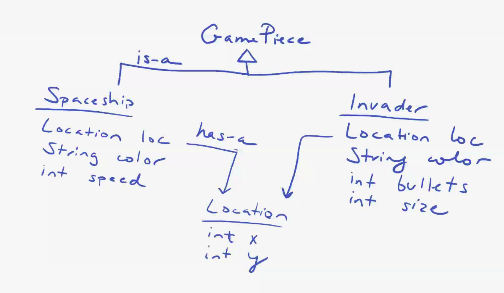
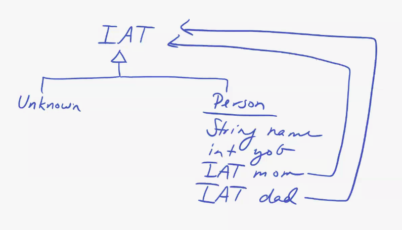
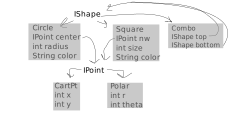
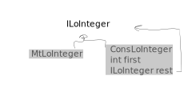
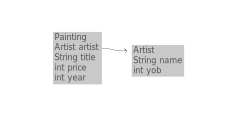

# The Class

[Class Website](https://course.ccs.neu.edu/cs2510/)

Fundamentals of Computer Science 1: Correct program behavior

Fundamentals of Computer Science 2: Having your code be scalable/maintainable/efficient 

2% late per hour per submission for homework assignments

Read lecture notes before coming to class

Code Review: Taking your code and explain it to somebody else
* Happens towards the end of the semester

# Introduction to Java

Data. We first started with *atomic data*. 

For example:

```scheme
;; a PosReal number representing the price of a coffee
(define coffee-price 3.5)
(define fancy-coffee (+ coffee-price 1.5))
(define extra-fancy-cofee (+ coffee-price "2 dollars")) 
; This won't work. Can't add number to integer.

;; An Auto is a (make-auto Integar Integar String PosReal)
(define-struct auto (x y color speed))
```
DrRacket doesn't know that this is wrong until you run it. `Auto` is an example
of compound data--meaning it holds multiple values.

Java is infix notation.

This code would not have *compiled*.

Java is a **strongly typed language** (data is checked at compile time). And ISL
is **dynamically typed** (data is checked at run time).

## Java Variables
In Java there are two types of numbers: Integers and Doubles. (There are more,
but we only care about these 2 for now.)

Also, you can't have dashes in Java's names--instead use camelCase.
Example in Java:
```java
// Primative Types
int distance = 3;
double coffeePrice = 3.5;
String hi = "hello";
char a = 'a';
boolean isSunny = false;
```

Why is String capitalized? Because it is not a primitive data type. 

## Compound Data in Java
### Example - Auto

<div style='width: 100%' class='ui rounded images'>

</div>

```java
class Auto {
    //int x;
    //int y;
    Location loc;
    String color;
    double speed;
    //Auto(int x, int y, String color, double speed){ // This is a constructor
    Auto(Location loc, String color, double speed){
        //this.x = x; // _this_ means the one in the class
        //this.y = y;
        this.loc = loc;
        this.color = color;
        this.speed = speed;
    }
}
class Location{
    int x;
    int y;
    Location(int x, int y){
        this.x = x;
        this.y = y;
    }
}
class ExamplesAuto{
    Location Loc34 = new Location(3, 4);
    Auto car1 = new Auto(Loc34, "red", 50.0);
    ExamplesAuto(){}
}

```

# Unions

### Example - Spaceships


<div style='width: 100%' class='ui rounded images'>

</div>

**Racket**:
```scheme
(define-struct invader (loc color bullets size))
;; An Invader is a (make-invader Posn String PosInt PosInt

(define invader1 (make-invader (make-posn 60 120) "green" 30 3))

#;(define (invader-temp1 inv)
    (posn-temp1 (invader-loc inv))
    (invader-color inv)
    (invader-bullets inv)
    (invader-size inv))

(define-struct ship (loc color speed))
;; A Shapeship is a (make-ship Posn String PosInt)
;; interp.: loc is a position on the Cartesian plane
;; speed is measured in miles/hour
    

;; A GamePiece is one of:
;; - Spaceship
;; - Invader

```

NOTE: The Union data type is only in comments in DrRacket. In Java, however,
this is not in comments.

**Java**
```java
interface IGamePiece {}

// Represents an Invader in the game
class Spaceship implements IGamePiece {
    Location loc
    String color;
    int speed;
    Spaceship(Location loc, String color, int speed){
        this.loc = loc;
        this.color = color;
        this.speed = speed;
    }
}

// Represents an Invader in the game
class Invader implements IGamePiece {
    Location loc
    String color;
    int bullets;
    int size;
    Invader(Location loc, String color, int bullets, int size){
        this.loc = loc;
        this.color = color;
        this.bullets = bullets;
        this.size = size;
    }
}

// A class to represent a location on the Cartesian plane
class Location {
    int x;
    int y;
    Location(int x, int y){
        this.x = x;
        this.y = y;
    }
}

class Examples {
    // You cant do the line below because it doesn't know what loc1 is yet
    //Spaceship ship = new Spaceship(this.loc1, "blue", 55);
    
    Location loc1 = new Location(30, 40);
    Location loc2 = new Location(60, 80);
    // Represents two IGamePieces: Spaceships and Invaders
    IGamePiece ship = new Spaceship(this.loc1, "blue", 55);
    IGamePiece invader1 = new Invader(this.loc2, "pink", 30, 3);
    
    // You can still do this, but it's bad practice
    //Spaceship ship = new Spaceship(new Location(30, 40), "blue", 55); 
    
}
    
```

`IGamePiece` is the type at compile time

`Spaceship/Invader` is the type at run-time

Use the `this` keyword anytime you can--it removes ambiguity.

In Java, Unions are **interfaces**. The reason we would want to declare a
variable by it's Union is so it can be that type--which means that we can use
more general operations.

### Example - Ancestor Tree

**Racket**:
```racket
;; A Person is a (make-person String Person Person)
(define-struct person (name mom dad))

(define alice (make-person "Alice" 
                (make-person "Sally"
                    (make-person "Abby"
                        ...
; this issue with this definition is that you cannot stop--you need a base case
; for referential data

;; An AT is one of:
;; - #false
;; - (make-person String AT AT)
```

<div style='width: 100%' class='ui rounded images'>

</div>

**Java**:
```java
interface IAT{}

// Class to represent an unknown in an ancestor tree
class Unknown implements IAT {
    Unknown() {}
}

// Class to represent a person in an ancestor tree
class Person implements IAT {
    String name;
    int yob
    IAT mom;
    IAT dad;
    
    Person(String name, int yob, IAT mom, IAT dad) {
    this.name = name;
    this.yob = yob;
    this.mom = mom;
    this.dad = dad;
    }
}
```

# Methods

**Recall the design recipe for functions:**

* Signature
* Purpose Statement
* Examples/Tests
* Code
* Run

Consider the DrRacket code:

```scheme
;; Spaceship Integer -> Integer
;; produces a reduced speed for the given spaceship based on a given percentage
(check-expect (reduced-speed ship1 20) 80) ; ship1 has a speed of 100
(check-expect (reduced-speed ship2 50) 25) ; ship2 has a speed of 25 

(define (reduced-speed ship rate)
    (- (ship-speed ship) (/ (* (ship-speed ship) rate) 100)))
```

## Template
What do I have to work with?

You have to do a template for each class
* If a method takes in a complex data type, you need another template:
```java
/* everything in template above plus
* fields:
* ...
* methods:
* ...
* methods for fields:
* ...
```

In Java, we just list the things:
```java
import tester.*;

interface IGamePiece {
    //moves this IGamePiece by the given x and y
    IGamePiece move(int x, int y); //tells the program that every GamePiece has this method
}

// Represents an Invader in the game
class Invader implements IGamePiece {
    Location loc
    String color;
    int bullets;
    int size;
    
    Invader(Location loc, String color, int bullets, int size){
        this.loc = loc;
        this.color = color;
        this.bullets = bullets;
        this.size = size;
    }
    
    /* TEMPLATE HERE
    *
    */
    
    public IGamePice move(int x, int y){
        return new Invader(this.loc.move(x, y), this.color, this.bullets, this.size);
    }
}

// Represents an Spaceship in the game
class Spaceship implements IGamePiece {
    Location loc;
    String color;
    int speed; //in miles per hour
    
    Spaceship(Location loc, String color, int speed) {
        this.loc = loc;
        this.color = color;
        this.speed = speed;
    }
    
    /* fields:
    *   this.local ... Location
    *   this.color ... String
    *   this.speed ... int
    * methods:
    *   this.reducedSpeed(int) ... int
    *   this.move(int, int) ... Spaceship
    * methods for fields:
    *   this.loc.moveLocation(int, int) ... Location
    */
    
    // produces a reduced speed for this spaceship based on the given percentage
    int reducedSpeed(int rate) {
        return this.speed - ((this.speed * rate) / 100);
    }
    
    // produces a new spaceship that is shifted from this spaceship by the given x and y
    Spaceship move(int x, int y){
        return new Spaceship(this.loc.move(x,y), this.color, this.speed);
    }
}

class Location {
    int x;
    int y;
    Location(int x, int y){
        this.x = x;
        this.y = y;
    }
    
    /* fields
    *   this.x ... int
    *   this.y ... int
    * methods:
    *   this.moveLocation(int, int) ... Location
    */
    
    //Create a new Location that is shifted from this location by a given x and y
    Location move(int x, int y){
        return new Location(this.x + x, this.y + y);
    }
}

class Examples {
    Location loc1 = new Location(30, 40);
    Location loc2 = new Location(60, 80);
    
    Spaceship ship1 = new Spaceship(this.loc1, "blue", 100);
    Spaceship ship1 = new Spaceship(this.loc2, "pink", 30);
    
    //tests for reducing speed
    boolean testReducedSpeed(Tester t) { //these test methods need to start with the word `test`
        return t.checkExpect(this.ship1.reducedSpeed(20), 80) &&
               t.checkExpect(this.ship2.reducedSpeed(50), 15);
    }
    
    //tests for move
    boolean testMove(Tester t){
        return t.checkExpect(this.ship1.move(1, 2), 
               new Spaceship(new Location(31, 42), "blue", "100")) &&
               t.checkExpect(this.loc1.moveLocation(2, 3), new Location(32, 43));
    }
    
    //tests for move
    boolean testMove(Test t){
        return t.checkExpect(this.ship1.move(10, 20),
                            new Spaceship(new Location(40, 60), "blue", 55));
    //notice that we never ask if something is a Spaceship
}
```

## Methods for Unions

We can use the color class by importing the image library.

**Incorrect**:
```java
import java.awt.Color
import javalib.worldimages.*

//...

//In Spaceship class
WorldImage draw() {
    return new CircleImage(50, "solid", this.color)
}

// in Examples class
IGamePiece ship1 = new Spaceship(this.loc1, Color.BLUE, 55);

this.ship.draw() 
// this wouldn't work because draw is in the Spaceship class, NOT IGamePice (which ship1 is)
```

So in this case, you would want to put `draw()` in the interface (not just the `ship` class).

**Correct**:
```java
import java.awt.Color;
import javalib.worldimages.*;

interface IGamePice {
    //...
    WorldImage draw();
}

//...

//in spaceship class
public WorldImage draw() {
    return new EllipseImage(50, 60, "solid", this.color);
}

//In invader class
public WorldImage draw() {
    return new ...
}
```


### Example - Shape

```java
interface IShape {
    double area();
    boolean biggerThan(IShape that);
}

class Circle implements IShape {
    CartPt center;
    int radius; 
    String color;
    
    Circle(CartPt center, int radius, String color){
        this.center = center;
        this.radius = radius;
        this.color = color;
    }
    /*
     // ** TEMPLATE ** 
     public returnType methodName() {
     ... this.center ...              -- CartPt
     ... this.radius ...              -- int
     ... this.color ...               -- String
     
     ... this.area() ...                  -- double 
     ... this.distToOrigin() ...          -- double 
     ... this.grow(int inc) ...           -- IShape
     ... this.biggerThan(IShape that) ... -- boolean
     ... this.contains(CartPt pt) ...     -- boolean
     */
     // See Lecture code for all of these methods
    
    public double area(){
        return Math.PI * Math.pow(this.radius, 2);
    }
    
    public boolean biggerThan(IShape that){
        return this.area() > that.area();
    }
}

class Square implements IShape {
    CartPt nw;
    int size;
    String color;
    
    Square(CartPt nw, int size, String color) {
        this.nw = nw;
        this.size = size;
        this.color = color;
    }
    
        /*
     // ** TEMPLATE ** 
     returnType methodName() {
     ... this.nw ...              -- CartPt
     ... this.size ...            -- int
     ... this.color ...           -- String
     
     ... this.area() ...                  -- double 
     ... this.distToOrigin() ...          -- double 
     ... this.grow(int inc) ...           -- IShape
     }
     */
    
    // to compute the area of this shape
    public double area(){
        return this.size * this.size;
    }
    
    public boolean biggerThan(IShape that){
    /* everything in the Circle template plus:
    * fields of that:
    *
    * methods of that:
    * that.area() ... double
    */
        return this.area() > that.area();
    }
}

class CartPt {
    int x;
    int y;
    
    CartPt(int x, int y) {
        this.x = x;
        this.y = y;
    }
    
    // to compute the distance form this point to the origin
    public double distToOrigin(){
        return Math.sqrt(this.x * this.x + this.y * this.y);
    }
    
    // to compute the distance form this point to the given point
    public double distTo(CartPt pt){
        return Math.sqrt((this.x - pt.x) * (this.x - pt.x) + 
                         (this.y - pt.y) * (this.y - pt.y));
    }
}
```

**You can also nest interfaces**:
<div style='width: 100%' class='ui rounded images'>

</div>
```java
class Combo implements IShape {
    IShape top;
    IShape bottom;
    
    Combo(IShape top, Ishape bottom) {
        this.top = top;
        this.bottom = bottom;
    }
    
    /* fields:
    *   this.top ... IShape
    *   this.bottom ... IShape
    * methods:
    *   this.area() ... double
    *   this.biggerThan(IShape) ... boolean
    * methods for fields:
    *   this.top.area() ... double 
    *   this.bottom.area() ... double
    *   this.top.biggerThan(IShape) ... boolean
    *   this.bottom.biggerThan(IShape) ... boolean
    */
    
    public double area() {
        return this.top.area() + this.bottom.area();
    }
    
    public double biggerThan(IShape that){
        return this.area() > that.area();
    }
}

class ExamplesShapes{
    IShape combo1 = new Combo(this.c1, this.s1); //both c1 and s1 are IShapes
    IShape combo2 = new Combo(this.combo1, this.combo1);
}
```

## Methods for Self-referential lists 

Recall list of numbers from Fundies 1:
```scheme
;; A [List-of Number] is one of:
;; - '()
;; - (cons Number [List-of Number])
```
Notice the self-referential nature of this. 

### Example - List of Integers
<div style='width: 100%' class='ui rounded images'>

</div>

```java
interface ILoInteger{}

class MtLoInteger implements ILoInteger {} 
// By not having a constructor, it has the 'default' constructor which is nothing

class ConsLoInteger implements ILoInteger {
    int first;
    ILoInteger rest;
    
    ConsLoInteger(int first, ILoInteger rest) {
        this.first = first;
        this.rest = rest;
    }
}
```

Recall the template from Fundies 1:
```scheme
(define (Lon-temp alon)
    (cond [(empty? alon) ... ]
          [(cons? alon) ... (first alon)...
                            (lon-temp (rest alon)) ...]))
```

### Example - Painting

<div style='width: 100%' class='ui rounded images'>

</div>

```java
interface ILoPainting {
    //count the paintings in this list
    int count();
    //get the paintings in this list that are by the artist with the given name
    ILoPainting getByArtist(String name) {}
}

class MtLoPainting implements ILoPainting {
    /*
    methods:
        
    */
    
    // count the paintings in this MtLoPainting
    public int count(){
        return 0;
    }
    
    ILoPainting getByArtist(String name){
        return this;
    }
}

class ConsLoPainting implements ILoPainting {
    Painting first;
    ILoPainting rest;
    
    ConsLoPainting(Paining first, ILoPainting rest) {
        this.first = first;
        this.rest = rest;
    }
    
    /* fields:
        this.first ... Painting
        this.rest ... ILoPainting
       Methods:
        this.count() ... int
       Methods for fields:
        this.rest.count() ... Int
        this.rest.getByArtist(String) ... ILoPainting
    */
    public int count() {
        return 1 + this.rest.count();
    }
    
    ILoPainting getByArtist(String name) {
        if (this.first.getName(name)){
            return new ConsLoPainting(this.first, this.rest.getByArtist(name));
        } 
        else {
            return this.rest.getByArtist(name);
        }
    }
}

class Painting {
    Artist artist;
    String title;
    double price; // price in millions of dollars
    int year;
    
    Painting(Artist artist, String title, int price, int year) {
        this.artist = artist;
        this.title = title;
        this.price = price;
        this.year = year;
    }
    /* fields:
        this.artist ... Artist
        this.title ... String
        this.price ... Int
        this.year ... Int
       methods:
        this.count() ... int
        this.getByArtist(String) ... ILoPainting
       methods for fieds:
        this.artist.checkArtistName(String) ... boolean
    */
    
    //is the name of the artist of this Painting the same as the given one?
    boolean checkName(String name) {
        return this.artist.checkArtistName(name); 
    }
}

class Artist {
    String name;
    int yob;
    
    Artist(String name, int yob) {
        this.name = name;
        this.yob = yob;
    }
    
    /* fields
        this.name ... String
        this.yob ... int
       methods:
        this.checkArtistName(String) ... boolean
    */
    
    //is this artist's name the same as the given one?
    boolean checkArtistName(String name) {
        return this.name.equals(name);
    }
}

class Examples {
    ...
    ILoPainting mt = new MtLoPainting();
    ILoPainting list1 = new ConsLoPainting(this.mona, this.mt);
    ILoPainting list2 =new ConsLoPainting(this.sunflowers, list1);
}
```

### If Statement
```java
if (true-or-false-question) {
    runs if true
}
//the rest is optional
else {
    runs if false
}
```

### Insertion Sort

```java
//in interface:

    ILoPainting sortByYear();
    //inserts the given painting into this sorted list
    ILoPainting insertByYear(Painting p);

// in empty list
    public ILoPainting sortByYear() {
        return this;
    }

    public ILoPainting insertByYear(Painting p) {
        return new ConsLoPainting(p, this);
    }
// in ConsLoPainting
    public ILoPainting sortByYear() {
        return this.rest.sortByYear().insertByYear(this.first);
    }
    
    //insert the painting into this sorted list,
    //list remains sorted after exiting the method
    public ILoPainting insertByYear(Painting p) {
        if (this.p.paintedBefore(first)) {
            return new ConsLoPainting(p, this);
        }
        else {
            return new ConsLoPainting(this.first, this.rest.insertByYear(p));
        }
    }
// in Painting
    boolean paintedBefore(Painting p) {
        return this.year < p.year;
    }
// in examples
    boolean testSort(Tester t) {
        return t.checkExpect(this.list2.sortByYear(), 
                             new ConsLoPainting(this.mona, 
                             new ConsLoPainting(this.sunflowers, this.mt)));
    }

```

## Accumulator Methods


When to use an accumulator:
1. What information do you need to keep track of? Add a parameter
2. What is the starting information? Remember it
3. How does the function accumulate knowledge? Is it `+`, `cons`, selector?
4. How do you use the accumulator? 
Wrapped in a local -- or helper -- and initialized with starting information

### Example - List of Strings
```java
interface ILoString {
    //concatenate the strings in this list in reverse order
    String reverseConcat();
    //helps to reverse concatenate this list
    //accumulator: reversed concatenated string so far
    String reverseConcatAcc(String acc);
}

class MtLoString implements ILoString {
    //concatenate the strings in this list in reverse order
    String reverseConcat(){
        return "";
    }
    
    //helps to reverse concatenate this list
    //accumulator: reversed concatenated string so far
    String reverseConcatAcc(String acc) {
        return acc;
    }
}

class ConsLoString implements ILoString {
    String first;
    ILoString rest;
    
    ConsLoString(String first, ILoString rest) {
        this.first = first;
        this.rest = rest;
    }
    
    //concatenate the strings in this list in reverse order
    String reverseConcat() {
        return this.reverseConcatAcc("");
    }
    
    //helps to reverse concatenate this list
    //accumulator: reversed concatenated string so far
    String reverseConcatAcc(String acc) {
        return this.rest.reverseConcatAcc(this.first + " " + acc);
    }
}
```

### Example - IAT
```java
interface IAT {
    //list the names in this tree
    ILoString names();
    //helps accumulate the names on the dad's side of the tree
    //accumulator: keeps track of the names on the dad's side
    ILoString namesAcc(ILoString acc);
    
    //is this tree well-formed?
    boolean wellFormed();
    
    //help to check if this tree is well-formed
    //accumulator: keeps track of the child's year of birth
    boolean wellFormedHelp(int childYob);
    
    //produce the IAT that is younger between this IAT and a given one
    IAT youngerIAT(IAT other);
    
    //produce the IAT that is younger between this IAT and a given one
    IAT youngerIATHelp(IAT other, int yob);
}

class Unknown implements IAT {
    Unknown() {}
    
    public ILoString names() {
        return new MtLoString();
    }
    
    public ILoString namesAcc(ILoString acc){
        return acc;
    }
    
    boolean wellFormed() {
        return true;
    }
    
    boolean wellFormedHelp(int childYob) {
        return true;
    }
    
    public youngerIAT(IAT other) {
        return other;
    }
    
    public IAT youngerIATHelp(IAT other, int yob){
        return other;
    }
}

class Person implements IAT {
    String name;
    int yob;
    IAT mom;
    IAT dad;
    
    Person(String name, int yob, IAT mom, IAT dad) {
        this.name = name;
        this.yob = yob;
        this.mom = mom;
        this.dad = dad;
    }
    
    public ILoString names() {
        return this.namesAcc(new MtLoString());
    }
    
    public ILoString namesAcc(ILoString acc){
        return new ConsLoString(this.name, this.mom.names(this.dad.names(acc)));
    }
    
    boolean wellFormed() {
        return this.mom.wellFormedHelp(this.yob) &&
               this.dad.wellFormedHelp(this.yob);
    }
    
    boolean wellFormedHelp(int childYob) {
        return this.yob < childYob &&
               this.mom.wellFormed(this.yob) &&
               this.dad.wellFormed(this.yob);
    }
    
    public youngerIAT(IAT other) {
        return other.youngerIATHelp(this, this.yob); //you don't have to ask what other is
    }
    
    public IAT youngerIATHelp(IAT other, int year){
        if(this.yob > year) {
            return this;
        } else {
            return other;
        }
    }
}
```

Another way to do this problem is to append the father list and the mother list before putting them into the `consLoString`:

```java
public ILoString names2() {
    return new ConsLoString(this.name, this.mom.names2().append(this.dad.names2()));
}
```
