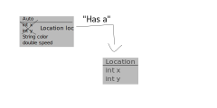

# The Class

[Class Website](https://course.ccs.neu.edu/cs2510/)

Fundamentals of Computer Science 1: Correct program behavior

Fundamentals of Computer Science 2: Having your code be scalable/maintainable/efficient 

2% late per hour per submission for homework assignments

Read lecture notes before coming to class

Code Review: Taking your code and explain it to somebody else
* Happens towards the end of the semester

# Introduction to Java

Data. We first started with *atomic data*. 

For example:

```scheme
;; a PosReal number representing the price of a coffee
(define coffee-price 3.5)
(define fancy-coffee (+ coffee-price 1.5))
(define extra-fancy-cofee (+ coffee-price "2 dollars")) 
; This won't work. Can't add number to integer.

;; An Auto is a (make-auto Integar Integar String PosReal)
(define-struct auto (x y color speed))
```
DrRacket doesn't know that this is wrong until you run it. `Auto` is an example
of compound data--meaning it holds multiple values.

This code would not have *compiled*.

Java is a **strongly typed language** (data is checked at compile time). And ISL
is **dynamically typed** (data is checked at run time).

## Java Variables
In Java there are two types of numbers: Integers and Doubles. (There are more,
but we only care about these 2 for now.)

Also, you can't have dashes in Java's names--instead use camelCase.
Example in Java:
```java
// Primative Types
int distance = 3;
double coffeePrice = 3.5;
String hi = "hello";
char a = 'a';
boolean isSunny = false;
```

Why is String capitalized? Because it is not a primitive data type. 

## Compound Data in Java
`Auto` example:

<div style='width: 100%' class='ui rounded images'>

</div>


```java
class Auto {
    //int x;
    //int y;
    Location loc;
    String color;
    double speed;
    //Auto(int x, int y, String color, double speed){ // This is a constructor
    Auto(Location loc, String color, double speed){
        //this.x = x; // _this_ means the one in the class
        //this.y = y;
        this.loc = loc;
        this.color = color;
        this.speed = speed;
    }
}
class Location{
    int x;
    int y;
    Location(int x, int y){
        this.x = x;
        this.y = y;
    }
}
class ExamplesAuto{
    Location Loc34 = new Location(3, 4);
    Auto car1 = new Auto(Loc34, "red", 50.0);
    ExamplesAuto(){}
}

```
