# The Class

Does not collect homework, however, the quizzes build off the homework
assignments. Some sections--about 5--of the homework will be collected and make up of the
5%. Will be graded for completeness.

First quiz will be next Wednesday (the 27th)

This class has a midterm and a final

Midterm is March 11th

# Rates of Change and the Derivative

## Average Rate of Change
**Example 1:**

What is the (average) velocity during the 2 min?
$\text{avg v} = \frac{\Delta P}{\Delta t} = \frac{1\text{mile}}{\frac{1}{30}h} =
30 mph?$

Speedometer: instantaneous velocity 

We will be the average rate of change to approximate the instantaneous rate of
change.

AROC (average rate of change) for $f$ with respect to (wrt) $x$ between $x=a$
and $x=b$ or interval $[a,b]$ where $a<b$.

$\frac{\Delta y}{\Delta x} = \frac{\Delta f}{\Delta x} = \frac{f(b)-f(a)}{b-a}$ 

This is called the *difference quotient*.

**Example 2:**

At times $t=0,\ 1\ 5$ hours, the car is moving  $v=30,\ 60,\ 40\ mph$
respectively  what are the accelerations between $[0,1],\ [0,5],\ [1,5]$?

**Recall**: Average acceleration  $= \frac{\Delta v}{\Delta t}$

$[0,1]\ a_1=\frac{v(1)-v(0)}{1-0}= \frac{60-30}{1} = 30mph$ 

$[0,5]\ a_2 = \frac{v(5)-v(0)}{5-0} = \frac{40-30}{5-0} = 2mph$ 

$[1,5]\ a_3 = \frac{v(5)-v(1)}{5-1} = \frac{40-60}{5-1} = \frac{-20}{4} = -5mph$

**Example 3:**

What is the AROC of area, $A$, in in$^2$ of 16:9 widescreen TV wrt the
diagonal? $d$ (diagonal) between d=32 in d=40in and 40in and 52in?

To solve this, we want $A(d)$ 

Then we will find $\frac{\Delta A}{\Delta d}$

$A = 16x \times 9x = 337x^{2}$

$(9x)^{2}+(16x)^{2} = d^{2}$
 
$\therefore 337x^{2} = d^{2}$
 
$A(d) = \frac{144}{337}d^{2}$

We want $\frac{\Delta A}{\Delta d}$ from [32, 40]

$\frac{\Delta A}{\Delta d} = \frac{A(40) - A(32)}{40-32}$

$\frac{\Delta A}{\Delta d} = \frac{\frac{144}{337}(40^{2}-32^{2})}{8} =
\frac{144}{337} * 72 \approx 30.7 \frac{in^2}{in}$

Now do $\frac{\Delta A}{\Delta d}$ from [40, 52]

$\frac{\Delta A}{\Delta d} = \frac{A(52) - A(40)}{52-40} =
\frac{\frac{144}{337}(52^2-42^2)}{12} \approx 39.31 \frac{in^2}{in}$

Because these numbers are different for the different ranges, we know that it is
dependent on the diagonal.

Ex. 1.1.8

$y=f(x)=4-x^{2}$ 

What is the AROC of $y$ wrt $x$ on [1,2]

$\frac{\Delta y}{\Delta x} = \frac{\Delta f}{\Delta x} = \frac{f(2) - f(1)}{2-1}$ 
$= \frac{(4-2^{2}) - (4-1^{2})}{1} = \frac{0-3}{1}=-3$

### Def. 1.1.9 - Secant Line

For function $y=f(x)$ and two x values $a$ and $b$. We will define the *secant
line* of $f$ as the line through the points (a, f(a)) and (b, f(b))

### Prop 1.1.10 - Slope of Secant Line

Given $y=f(x)$ and $a<b$ the AROC of $f$ on [a,b] is the slope of the secant
line of $f$ for $x=a$ and $x=b$. 

## Instantaneous Rates of Change

Suppose we want the car's velocity at t=12 min?

If $v = \frac{\Delta p}{\Delta t}$ 

Solution take average between $t=a$ and $t=a+h$ and let $h$ go to 0.

### Def. 1.2.3 - Limit Definition of Derivative
Given $y=f(x)$, the new function $f'$ which is given by 
$f'(x) = \lim_{\Delta x \to 0} \frac{f(x+\Delta x) - f(x)}{\Delta x} $

$f'(x) = \lim_{h \to 0} \frac{f(x+h) - f(x)}{h}$ 

This is called the derivative of $f$ with respect to $x$ and is the
**instantaneous rate of change** for any value of $x$ for which the limit
exists. This means that if the limit does not exist, the derivative does not
either.

**Ex. 1.2.2**

Recall the 16:9 TV example above.

$A(d) = \frac{144}{337}d^{2}$

What is the derivative (or IROC) of $A$ wrt to $d$ when $d=40in$?

$A'(d) = \lim_{h \to 0} \frac{A(d+h) - A(d)}{h}$ 

$= \lim_{h \to 0} \frac{\frac{144}{337}(d+h)^{2} - \frac{144}{337}d^{2}}{h}$
$= \lim_{h \to 0} \frac{144}{337} \frac{d^{2}+2dh+h^{2} - d^{2}}{h}$ 

$A'(d) = \lim_{h \to 0} \frac{144}{337} \frac{h(2d+h)}{h} = \frac{144}{337} 2d$

$A'(40) = \frac{144}{337} 2(40) \approx 34.2 \frac{in^{2}}{in}$ 

**Secant Line**:

Consider a function with secant-lines (20, 55), (22,40), (20, 27)

The smaller the interval, the closer it becomes to the instantaneous rate of
change.

Recall: $A'(d) = \frac{144}{337} 2d$

IROC of $A$ wrt $d$ at 20, $A(20)$=tangent to the graph at that point.

What is the equation of the tangent line?

$A(20) = A'(20)(d-20)$
$A-170.92 = 17.09(d-20)$

Recall:
### Point-slope Form
$y-y_1 = f'(x_1)(x-x_1)$

Given particle with position $p(t) = \frac{1}{\sqrt{t}}$ for $t>0$ what the
velocity?

$p'(t) = v(t) = \lim_{h \to 0} \frac{p(t+h)-p(t)}{h}$ 
$= \lim_{h \to 0} \frac{\frac{1}{\sqrt{t+h} }-\frac{1}{\sqrt{t}}}{h}$ 

$p'(t) = \lim_{h \to 0} \frac{\frac{1 * \sqrt{t}}{\sqrt{t+h} * \sqrt{t}}- \frac{1 * \sqrt{t+h} }{\sqrt{t} \sqrt{t+h} }}{h}$

$p'(t) = \lim_{h \to 0} \frac{1}{h} \frac{\sqrt{t} -\sqrt{t+h} }{\sqrt{t+h} \sqrt{t} } \frac{\sqrt{t} + \sqrt{t+h} }{\sqrt{t} +\sqrt{t+h} }$

$p'(t) = \lim_{h \to 0} \frac{1}{h} \frac{t-(t+h)}{\sqrt{t+h} \sqrt{t} (\sqrt{t} + \sqrt{t+h} )}$

$p'(t) = \frac{-1}{t * 2 * \sqrt{t} }$

---

# 1.3 Limits and Continuity

Quiz is going to be on sections 1, 2, 3 on Wednesday 1/27

$f(x) = \sin(x)$

$f(x) = \frac{1}{x}$ 

Consider:

$f(x) = \frac{\sin(x)}{x}$ 

$f(1) = 0.84$

$f(0.2) = 0.993$ 

...

So we can say:

$\lim_{x \to 0^+} \frac{\sin(x)}{x} = 1$

$\lim_{x \to 0^-} \frac{\sin(x)}{x} = 1$ 

When $\lim_{x \to 0^-} = \lim_{x \to 0^+}$ are the same, we say that the two-sided limit exists.

But $\frac{\sin(0)}{0} = \frac{0}{0}$ so we can't just do that.

Consider this graph

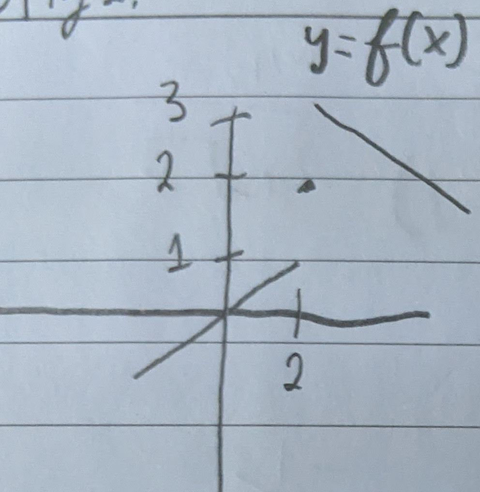

$\lim_{x \to 2^-} f(x) = 1$

$\lim_{x \to 2^+} f(x) = 3$

$\lim_{x \to 2} f(x) = DNE$

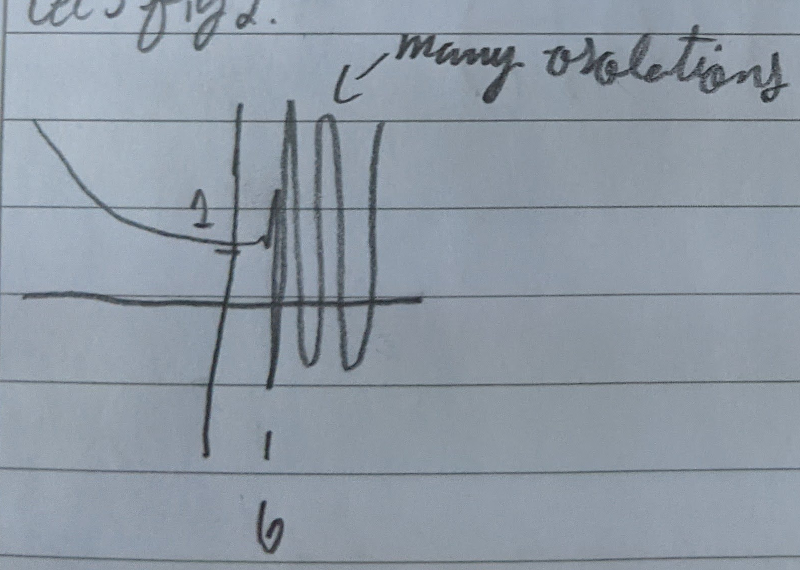

$\lim_{x \to 6^-} f(x) = 1$

$\lim_{x \to 6^+} f(x) = DNE$

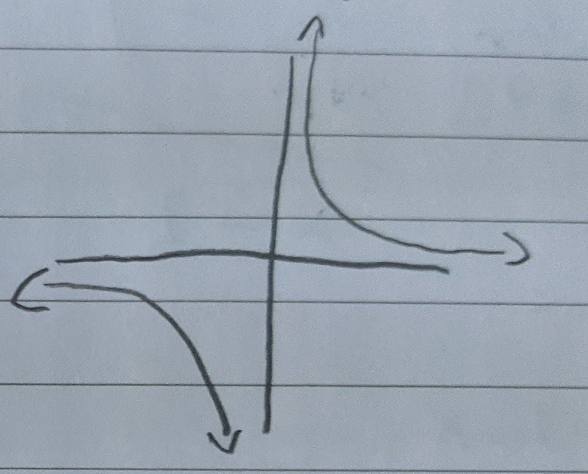

$\lim_{x \to 0^+} f(x) = +\infty$

$\lim_{x \to 0^-} f(x) = -\infty$ 

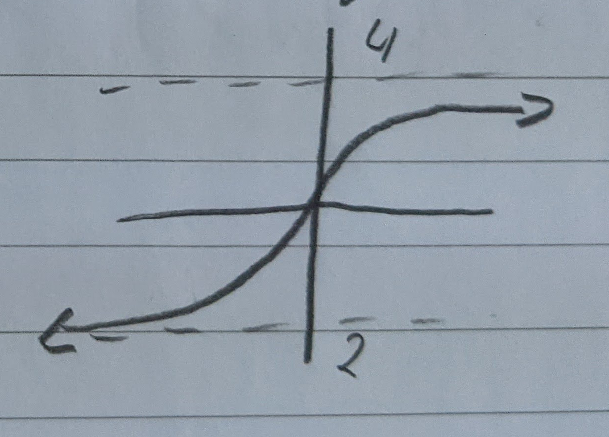

 
$\lim_{x \to \infty} f(x) = 4$

$\lim_{x \to \infty} f(x) = -2$

### Theorem 1.3.15: Limit Rules
Suppose $\lim_{x \to b} f(x) = L_1$ and $\lim_{x \to b} g(x) = L_2$ and $c$ is a real number.
1. The Limit of the constant $f_n$ -> the constant
2. $\lim_{x \to b} c * f(x) = c * L_1$
3. $\lim_{x \to b} [f(x) + g(x)] = L_1 + L_2$ 
4. $\lim_{x \to b} f(x)*g(x) = L_1 * L_2$ 
5. If $L_2 \neq 0$ then  $\lim_{x \to b} \frac{f(x)}{g(x)} = \frac{L_1}{L_2}$ 

Example 1:

$\lim_{x \to 2} g(x) = 4x^{3}-5x+7$
$= 4 \lim_{x \to 2} x^{3} - 5 \lim_{x \to 2} x + \lim_{x \to 2} 7$

$= 4(\lim_{x \to 2} x * \lim_{x \to 2} x * \lim_{x \to 2} x) - \lim_{x \to 2} x + 7 $ (now just substitute)

$= 29$

Example 2:

$\lim_{x \to 2} \frac{x^{2}-4}{x-2} = \lim_{x \to 2} \frac{(x-2)(x+2)}{x-2} = \lim_{x \to 2} (x+2) = 4$ 

Example 3:

$\lim_{x \to 1} \frac{\frac{1}{\sqrt{x} }-1}{x-1} = \lim_{x \to 1} \frac{1-\sqrt{x} }{\sqrt{x} (x-1)} * \frac{1+\sqrt{x} }{1+\sqrt{x} }$

$\lim_{x \to 1} \frac{1-x}{\sqrt{x} (x-1)(1+\sqrt{x} )} = \lim_{x \to 1} \frac{-1}{\sqrt{1} (1+\sqrt{1} )} = \frac{-1}{2}$

### Continuity 

If $\lim_{x \to a} f(x) = f(a)$ then we say that $f(x)$ is continuous. (We want this because continuous functions have derivatives.)

Discontinuous Functions have the following:
* Holes
* Jumps
* Asymptote 
* Removable lack of continuity 

# 1.4 Instantaneous Rates of Change: The Derivative 
Homework is going to be collected

## Limit Definition of the Derivative
$f'(x) = \lim_{\Delta x \to 0} \frac{f(x+\Delta x) - f(x)}{\Delta x}$ 

$= \lim_{h \to 0} \frac{f(x+h)-f(x)}{h}$ 

### Notation:

$f', y', \frac{dy}{dx}$

$\frac{dy}{dx} \mid _{x=a}$ means $f'(a)$

### Propositions:
Suppose $c$ is a constant and $f$ is differentiable at $x$ then $cf$ is also differentiable at x and $f'(c*x) = c*f'(x)$.

Suppose $f$ and $g$ are differentiable at $x$ then $f+g$ is differentiable at $x$ and $(f+g)'(x) = f'(x)+g'(x)$ (or $\frac{d}{dx}(f+g) = \frac{df}{dx}+ \frac{dg}{dx}$).

### Examples:

Example 1:

Find the derivatives  $w', y', z'$ and evaluate at  $x=1$ for $w=f(x)=c$, $y=g(x)=x$ and $z=m(x)=x^{2}$.

* $w'= \lim_{h \to 0} \frac{f(x+h)-f(x)}{h} = \lim_{h \to 0} \frac{c-c}{h}=0$
* $y'= \lim_{h \to 0} \frac{g(x+h)-g(x)}{h}= \lim_{h \to 0} \frac{x+h-x}{h} = \lim_{h \to 0} \frac{h}{h} = 1$
* $z'=\lim_{h \to 0} \frac{m(x+h)-m(x)}{h}= \lim_{h \to 0} \frac{(x+h)^{2}-x^{2}}{h} = \lim_{h \to 0} \frac{x^{2}+2xh+h^{2}-x^2}{h} = \lim_{h \to 0} 2x+h = 2x$

* $w'(1) = 0$
* $y'(1) = 1$
* $m'(1) = 2(1) = 2$

**Slope-point form**: $y-y_1 = f'(x_1)(x-x_1)$

Example 2:

A particle has velocity given by $v = \frac{1}{2\sqrt{t+2} }$ for $t>2$. Find the acceleration.
* Answer: $\frac{-1}{4(t+2)^{3/2}}$
HINT: The trick for radicals is multiply by the conjugate.

## Differentiability

If $f$ is differentiable at $x$ then $f$ is continuous at $x$.

If $f$ is not continuous at $x$ then $f$ is not differentiable at $x$.

Places where $f$ can fail to be differentiable:
* Breaks/Jumps
* Corners or cusps
    * Example $f(x) = \mid x\mid $ 
* Vertical tangents

**Exercise 19.**

Find equations of tangent lines of $f$ at given points

$r(x) = \frac{1}{1+x}$, $x=0,1,2$ 

$r'(x) = \frac{-1}{(1+x)^{2}}$ 

* $r(0) = 1$
* $r(1) = \frac{1}{2}$
* $r(2) = \frac{1}{3}$

* $r'(0) = -1$
* $r'(1) = \frac{-1}{4}$ 
* $r'(2) = \frac{-1}{9}$ 

Recall 
**Slope-point form**: $y-y_1 = f'(x_1)(x-x_1)$

* $y-1 = -1(x-0) = y-1 = -x$
* $y-\frac{1}{2} = \frac{-1}{4}(x-1)$
* $y-\frac{1}{3} = \frac{-1}{9}(x-2)$

# 1.5 Extrema and the Mean Value Theorem

## Extrema
Extreme values -- maximum or minimum

Recall:

$f(x) = x^{2}$

$f'(x) = 2x$

* $f'(2) = 2(2) = 4$
* $f'(-2) = 2(-2) = -4$ 

We know that this function makes one turn (at point x=0). That's it's **absolute minimum**

Consider $g(x)$:

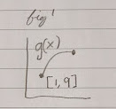

does this have a minimum and maximum?
Yes!

Consider $h(x)$ :

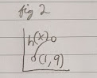

Does this have a minimum and maximum?

No! You can always get closer

But you can have **local max and min**:

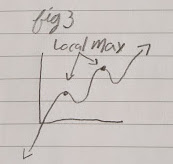

You can also have **local min and global(/absolute) min**:

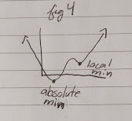

**Local Extrema**: Larger/smaller than its neighbors

**Global/Absolute Extrema**: The largest/the smallest value in the entire function

## Extreme Value Theorem

if a $f$ is continuous on $[a,b]$, then $f$ has both a maximum and a minimum on $[a,b]$ 

### Theorem 1.5.4

If $f$ is differentiable at $x$ and obtains a local extreme value at $x$, then $f'(x)=0$. 

**Definition - Critical Point**:

For a function, a critical point is any value $x$ such that $f'(x)=0$ or $f'(x)$ does not exist.

A critical value of $f$ is the value of $f$ at the critical point.

If $f$ attains a local extreme value at $x$ then $x$ must be a critical point.

To find extreme values in $[a,b]$:
1. Find the critical points in $(a,b)$ 
2. Evaluate $f$ at critical points and the end points a and b
3. Largest=max, smallest=min

### Examples
Find global max and min of $f(x)=2x^{3}-15x^{2}+36x$ on $[1,5]$ and determine where they occur:

$f'(x) = 6x^{2}-30x+36$ 

$f'(x) = 0 = 6(x^{2}-5x+6)$

$0=x^{2}-5x+6$

$0=(x-3)(x-2)$

$\therefore f'(x) = 0 \text{ when } x=3,2$

$f(1) = 23$

$f(2) = 28$

$f(3) = 27$

$f(5) = 55$

Therefore, our global max is 55 and our global min is 23.

## Mean Value Theorem 

**Mean Value Theorem (for derivatives)**

If $f$ is differentiable over $[a,b]$ then at some point  $c$ between $a+b$:

$\frac{f(b)-f(a)}{b-a} = f'(c)$

Rolle's Theorem: 

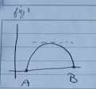

Consider another example:

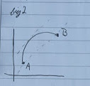

$f(b)-f(a) = f'(c)(b-a)$

(assume b>a)

if  $f'(c) > 0 \implies f(b) > f(a)$ which means that the function is increasing. 

if $f'(c) < 0 \implies f(b) < f(a)$ which means that the function is decreasing

If we are decreasing on one side and increasing on another, we have a **local min**.

If we are increasing on one side and decreasing on another, we have a **local max**.

### First Derivative Test for Extrema

Suppose $c$ exists in our interval $(a,b)$ if $f'(x) > 0$ from $(a,c)$ and $f'(x) < 0$ from $(c,b)$, then $c$ is a **local max**. Vice versa is a **local min**.

Each critical point, the *behavior* of the function is changing.

Consider this example:

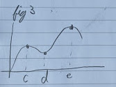

The behavior is the same in these intervals
* $(-\infty, c)$ 
* $(c,d)$
* $(d,e)$
* $(e,\infty)$ 

For the actual behavior in arbitrary points in these intervals, test the *derivative*. For the actual *min* and *max*, test the function.

Example:

1. Find a value of $c$ such that the conclusion of the *mean value theorem* is satisfied for $f(x) = -2x^{3}+6x-2$ on $[-2,2]$ 
2. Find the global extrema for our function on $[-2, 2]$
3. Find the local extrema and behavior of $f$ on $[-2, 2]$ 

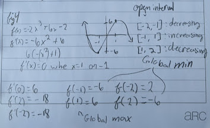

Proving the mean value theorem (visualization):

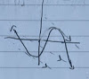

Recall: $f(b)-f(a) = f'(c) (b-a)$

# 1.6 Higher Order Derivatives

### Examples

Find the relative extrema and behavior of $f(x) = x^{3}$.

$f'(x) = 3x^{2} = 0$

$\therefore x=0$

Intervals:

* $(-\infty, 0)$ $f'(-1) = +3$ increasing
* $(0, \infty)$ $f'(1) = +3$ increasing

There are no extreme values:

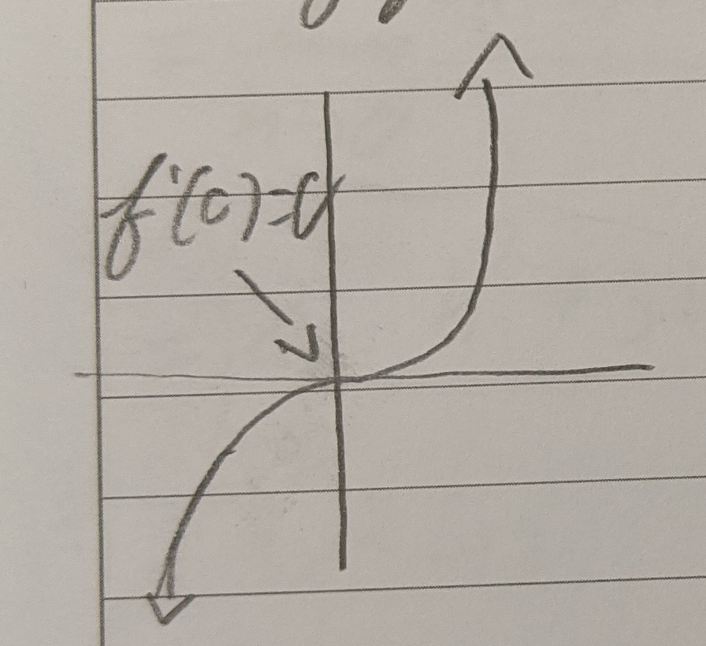

**Position**:

1st derivative: velocity
* Tangent line at a point

2nd derivative: acceleration

3rd derivative: jerk (we won't use it)

Consider this function:

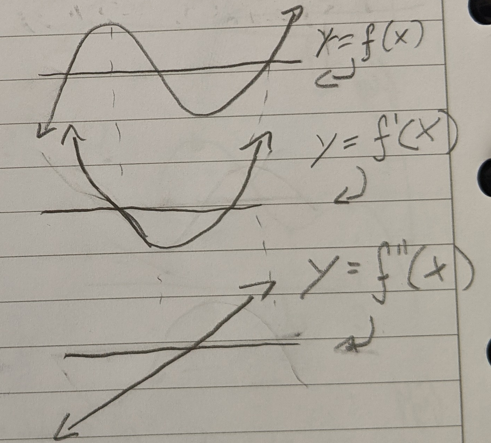

If $f''<0$ then  $f$ at that point is concave down
* And if $f'=0$ then it's a local max

If $f''>0$ then  $f$ at that point is concave up
* And if $f'=0$ then it's a local min

### Definition - Concave

The graph of $f$ is concave up on an interval if $f''(x)$ exists and is greater than 0 (on the interval).

The graph of $f$ is concave down on an interval if $f''(x)$ exists and is less than 0 (on the interval).

If the concavity switches at $x=b$ then we have an **inflection point** at $b$ (assume $b$ is in the domain of $f$).
* So if $f''$ switches from positive to negative, the inflection point is at 0.

### Theorem 1.6.9 - 2nd Derivative Test for Extrema

Suppose $f'(c)=0$. If  $f''(c)>0$, $f$ attains a local min at point $c$. If $f''(c)<0$, $f$ attains a local max at point $c$.

Example

$f(x) = 2x^{3}-15x^{2}+36x$

$f'(x) = 6x^{2}-30x+36$

$f'(x) = (x-3)(x-2)=0$

Critical points:

$x=2,3$

So  $f''(x)=12x-30$

$f''(2)=12(2)-30=-6<0 \therefore$ local max

$f''(3)=12(3)-30=+6>0 \therefore$ local min

Steps for the solution:
1. Find the extreme values
2. Find the intervals of concavity and any points of inflection
$f''(x) = 0 \therefore x=\frac{5}{2}$

So $x=2.5$ is a *possible* point of inflection

Intervals: $(-\infty, 2.5), (2.5, \infty)$ 

$f''(2) = -6$ concave up

$f''(3) = +6$ concave down
 
Therefore $x=2.5$ is a point of inflection.

If we have a polynomial, the points of concavity and the points of inflections are **NEVER** the same.

**Example:**

Calculate the concavity and extrema of $f(x)=\frac{1}{3}x^{3}-2x$

$f'(x)=x^{2}-2=0 \therefore x=-\sqrt{x}, \sqrt{x} $ 

$f''(x)=2x = 0 \therefore x=0$ possible inflection point at  $x=0$

$f''(-\sqrt{2}) = -2*\sqrt{2} $ because it's negative, it's a local max

$f''(\sqrt{2}) = 2*\sqrt{2} $ because it's positive, it's a local min
 
Because it goes from positive $f''$ to negative, $x=0$ *is* a point of inflection.

Behavior:

* $(-\infty, -\sqrt{2}) $ positive
* $(-\sqrt{2}, \sqrt{2}) $ negative
* $(\sqrt{2}, \infty)$ positive

**Example:** (practice)

Find the points of inflection, intervals of concavity, extrema, and behavior of $f(x)=x^{4}-4x^{3}+2$

$f'(x) = 4x^{3}-12x^{2}$

$f'(x) = 0 = 4x^{2}(x-3)$

$\therefore x=0, 3$ are critical points

Intervals:
* $(-\infty, 0)$ $f'(-1) = -16 \therefore$ decreasing
* $(0, 3) f'(1) = -8 \therefore$ decreasing
* $(3,\infty) f'(4) = 64 \therefore $ increasing

This means that $x=0$ is *not* an extrema. $x=3$ is a local min.

Second Derivative Test:

$f''(0) = 0$ inconclusive!

$f''(3) = 36 > 0 \therefore x=3$ is a local min
 
$f''(x) = 12x^{2}-24x$

$f''(x) = 0 = 12x(x-2)$

$\therefore x=0, 2$ these are possible points of inflection

$f''(-1) = 36$ positive

$f''(1) = -12$ negative 

$f''(3) = 36$ positive

Because they switch every value of  $x=0, 2$,  0 and 2 are points of inflection.

# 2.0 Rules for Derivative

Recall: $(x^{2})' = 2x$

### Theorem 2.1.1 Power Rule for Natural Exponents

Suppose $n$ is a positive integer, then $(x^n)' = n x^{n-1}$. Note: when $n=1$, $x^{0}=1=constant$.

Given $f(x)=x^{n}$, $f'(x) = \lim_{h \to 0} \frac{f(x+h)-f(x)}{h} = \lim_{h \to 0} \frac{(x+h)^{n}-x^{n}}{h}$.

Consider if $n=2$, the first part of the numerator would be: $x^{2}+2xh+h^{2}$

Consider if $n=3$, the first part of the numerator would be: $x^{2}+3x^{2}h+3xh^{2}+h^{3}$ 

Both have a common form: $x^{n}+nx^{n-1}h+h^{2} p(x,h)$ (p as in polynomial)

$f'(x) = \lim_{h \to 0} \frac{x^{n}+nx^{x-1}h+h^{2}p(x)h - x^{n}}{h}$ 

$f'(x) = nx^{n-1} + p(x,h) = nx^{n-1}$ 

**Example**:

$g(x) = \frac{d}{dt}(5t^{3}-\sqrt{7} t^{2})$ 

$g(x) = 5 \frac{d}{dt}t^{3} - \sqrt{7} \frac{d}{dt}t^{2}$

$g(x) = 15 ^{2} - 2\sqrt{7} t$

**Example**:

$f(x) = x^{3}$

$f'(x) = 3x^{2} = 0 \therefore x=0$

This, however, does not mean that we have a local or global extrema at this point. 

# 2.1 The Power Rule and Linearity

### Topic: Summation Notation

Consider a real function $B$ that has terms from I=m to n. What does the sum of its terms look like?

$B(m) + B(m+1) + ... + B(n-1) + B(n) = \sum_{i=m}^{n} B(i)$

**Example**:

$\sum_{i=-1}^{3} i^{2} = (-1)^{2} + (0)^2 + (1)^2 + (2)^2 + (3)^2 = 15$

### Theorem 2.1.8 Derivative of Polynomial Summations

Suppose $p(x)$ is a polynomial function

$p(x) = a_0 + a_1 * x + a_2 x^2 + ... + a_{n-1}x^{n-1} + a_n x^n = \sum_{i=0}^{n} a_ix^i$

Then $p'(x) = a_1 + 2a_2x + ... a_{n-1}(n-1)x^{n-2} + a_{n}nx^{n-1} = \sum_{i=1}^{n} a_i i x^{i-1}$

# 2.2 The Product and Quotient Rule 

Theorem:
Suppose $f$ and $g$ are differentiable at $x$.

Then:
1. The product rule: 

$f(x) * g(x)$ is differentiable  

$(f*g)'(x) = f(x) g'(x) + f'(x) g(x)$

2. Quotient Rule:  $f g(x) \neq 0$

 $\frac{f}{g}$ is differentiable at $x$ and $\left( \frac{f}{g} \right)' (x) = \frac{g(x) f'(x) - f(x) g'(x)}{(g(x))^{2}}$ 

NOTE: We rarely want to expand the $(g(x))^{2}$ in the denominator.

**Example**:

$f(x) = \frac{1}{x-1}$ 

$f'(x) = \frac{(x-1)*0 - 1(1)}{(x-1)^2} = \frac{-1}{(x-1)^{2}}$ 

Don't expand the bottom!

**Example**:

$g(v) = (5v^{2}-2v)(v^7 + 2)$

Find $g'(v) = 45v^8 + 20v - 16v^7 - 4$ 

**Example**:

Calculate:  $\left( \frac{w^3 + 4w}{w-1} \right)' = \frac{2w^3 - 3w^2 -4}{(w-1)^2}$ 

## Power Rule for Integers

For all $x$ in the domain of  $x^n$, $\left( x^n \right)' = n x^{n-1}$.

Proof
For for $n \le -1$ 
* i.e. when $n=-m$ and $m\ge 1$

Quotient Rule: $\left( \frac{1}{x^{m}} \right) = \frac{x^m * 0  - mx^{m-1}}{(x^m)^2} = mx^{m-1-2m} = mx^{-m-1} = nx^{n-1}$

**Example**:

Find the critical points and intervals of increasing and decreasing for $f(x) = \frac{x^2 -2x -1}{2x-5}$ 

Recall the quotient rule.

$f'(x) = \frac{2(x-2)(x-3)}{(2x-5)^{2}}$

Therefore the critical points are: 2, 2.5 (because it doesn't exist), and 3. Also the function doesn't exist at 2.5.

Interval:

NOTE: We only test the numerator because the denominator is squared and therefore always positive

* $(-\infty, 2) f_a'(0) = 2(0)^2 - 10(0) + 12 = 12$ positive
* $(2, 2.5) f_a'(2.4) = 2(2.4)^2 - 10(2.4) + 12 = -0.48$ negative
* $(2.5, 3) f_a'(2.75) = 2(2.75)^2 - 10(2.75) + 12 = -0.375$ negative
* $(3, \infty) f_a'(5) = 2(5)^2 - 10(5) + 12 = 12$ positive

Therefore: 
* 2 is a local max
* 3 is a local min

**Example**:

Given the equation for the tangent line to the graph of $y=f(x)$ at given points.

$f(x) = \frac{1}{1+x^n}; (1, \frac{1}{2})$ 

$f'(x) = \frac{-nx^{n-1}}{(1+x^n)^2}$

$f(1) = \frac{1}{2}$ 

$f'(1) = \frac{-n * 1^{n-1}}{(1+1^n)^2}$

$f'(1) = \frac{-n}{4}$ 

$y-\frac{1}{2} = \left( \frac{-n}{4} \right) (x-1)$

# 2.3 The Chain Rule

Suppose $g$ is differentiable at $x$ and $f$ is differentiable at $g(x)$. Then, $f(g(x))$ is differentiable at $x$ and $(f(g(x)))' = f'(g(x)) * g'(x)$

Leibniz Notation:

Suppose $u=g(x)=2x$ and $y=f(u)=\sin(u)$. We want $\frac{dy}{dx} = \frac{dy}{du} * \frac{du}{dx} = \frac{d}{dx} \sin(2x) = \cos(2x) * 2$.

This can also be expanded:

$\frac{dy}{dz} = \frac{dy}{du} * \frac{du}{dx} * \frac{dx}{dr} * \frac{dr}{dz}$

**Example**:

Consider $f(x) = x^{3}$ and $g(x) = 2x^{2}$. This can be represented as $(f \bullet g)(x)$

$h(x) = f(g(x)) = \left( 2 x^{2} \right) ^{3}$
 
$h'(x) = f'(g(x)) * g'(x) = 3(2x^{2})^{2} * 2 * 2x = 48x^{5}$

**Example**:

Differentiate: $((x^{2}+1)^{2} + 2x^{3})^{4}$ 

$= 4 ((x^{2}+1)^2 + 2x^{3})^{3} * (2(x^{2}+1) * 2x + 6x^{2})$

**Example**:

$V = \frac{4}{3}\pi R^{3}$
 
We are given $\frac{dV}{dt} = 64 \frac{in^{3}}{s}$ 

At what rate is the radius increasing when the radius is 3 in?

NOTE: All of our rates are with respect to time.

We are looking for $\frac{dR}{dt} \mid _{R=3in}$

$\frac{dV}{dt} = \frac{dV}{dR} * \frac{dR}{dt} = 4\pi R^{2} * \frac{dR}{dt}$ 

$\frac{dR}{dt} = \frac{1}{4\pi R^{2}} * \frac{dV}{dt}$ 

$\therefore \frac{dV}{dt} = \frac{1}{4\pi (3in)^{2}} 64 \frac{in^{3}}{s}$ 

$= \frac{16}{9\pi} \frac{in}{s} \approx 0.566 \frac{in}{s}$

**Example**

$z = \frac{1}{\sqrt{5w^{2}-7w} }$ find $\frac{dz}{dw}$ 

$= (5w^2 - 7w)^{\frac{-1}{2}}$

$\frac{dz}{dw} = \frac{-1}{2} (5w^2 - 7w)^{\frac{-3}{2}} * (10w - 7)$

$= \frac{-(10w-7)}{2(5w^2-7w)^{\frac{3}{2}}}$

## Chain Rule to Find Derivative of a Rational Power

Consider $f^{-1}(x) = x^{\frac{1}{3}}$ and $f(x) = x^3$

$f(f^{-1}(x)) = x$

Differentiate:

$f'(f^{-1}(x)) * f^{-1}'(x) = 1$

$\therefore (f^{-1}(x))' = \frac{1}{f'(f^{-1}(x))} = \frac{1}{3(f^{-1}(x))^2}$

$= \frac{1}{3 x^{\frac{2}{3}}}$

### Power Rule for Rational Powers

for $r$ rational and $x$ in the domain of $x^r$, then $x \neq 0$ the $f(x) = x^r$ is differentiable at $x$ and $(x^r)' = rx^{r-1}$

# Inverse Functions

An inverse of function is just the function reflected over the line $y=x$.

$f' = \frac{\Delta y}{\Delta x}$ 

$(f^{-1})' = \frac{\Delta x}{\Delta y}$ 

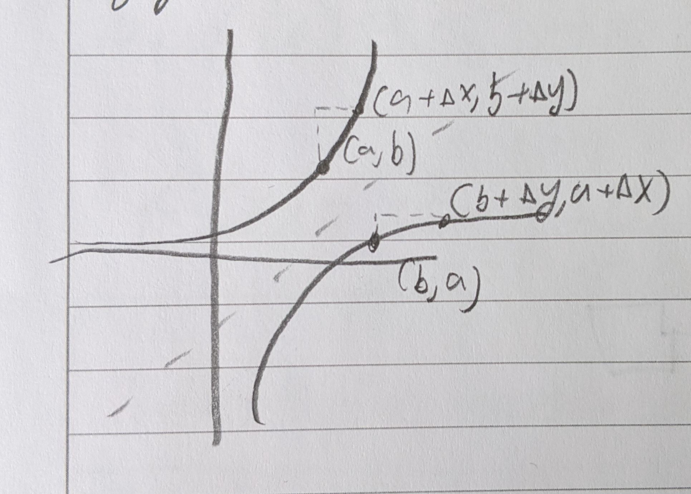

When the slope of the function is steep, the slope of the inverse is shallow and vice versa.

**Example**:

$y=x^{5}+x^{2}+1$

Inverse:

$x=y^5 + y^3 + 1$ (looks challenging)

**Operators**: 

Consider $(a, b)$

For the function: $f(a) = b$

For the inverse:  $f^{-1}(b)=a$ 

But what about the slope?

$(f^{-1}(b))' = \frac{1}{f'(a)} = \frac{1}{f'(f^{-1}(b))}$

Analytic Approach:

$f(f^{-1}(x)) = x$

Differentiate both sides:

 $f'(f^{-1}(x)) * (f^{-1}(x))' = 1$
 
$(f^{-1}(x))' = \frac{1}{f'(f^{-1}(x))}$

**Example**

48. Write the derivatives of the following in terms of $x,\ f,\ f'$ 
 
$g(x) = \frac{f(\frac{1}{x})}{x}$

$g'(x) = \frac{x*f'(\frac{1}{x}) * (\frac{-1}{x^2}) -f(\frac{1}{x})}{x^2}$

(Recall that $k(x) = f(\frac{1}{x}) = f(u)$ therefore $k'(x) = f'(u) * \frac{du}{dx}$ )

**Example**

$h(x) = \sqrt{f(x)^2 + 2} = (f(x)^2 + 2)^{\frac{1}{2}} $

$h'(x) = \frac{1}{2}(f(x)^2 + 2)^{\frac{-1}{2}} * 2 f(x) * f'(x)$

$h'(x) = \frac{f(x) f'(x)}{\sqrt{f(x)^2 + 2}}$

### Inverse Function Theorem
$(f^{-1}(b))' = \frac{1}{f'(a)}$

**Example**:

Find the slope of $f^{-1}$ for the function $f(x)=x^3 + x$ at the value $b=2$.

$f'(x) = 3x^2 + 1 > 0\ \forall x$ so it has an inverse. (It passes the horizontal line test).

$f(x) = x^3 + x = 2$

$\therefore x=2$

So our ordered pair is  $(a,b) = (1,2)$

$(f^{-1}(b))' = \frac{1}{f'(a)} = \frac{1}{4}$

**Exercise**:

Use the inverse function theorem to show the function and inverse have opposite concavity.

$(f^{-1}(x))' = \frac{1}{f'(f^{-1}(x))}$ 

$(f^{-1}(x))'' = \frac{-f''(f^{-1}(x))*(f^{-1}(x))}{f'(f^{-1}(x))^2}$

When $f$ is increasing, $f'(x) > 0$ and  $f^{-1}(x) > 0$

Therefore it has the opposite sign and therefore opposite concavity.

**Example**:

Use the inverse function theorem to calculate $f^{-1}$ at $b$ for $f(x) = x^2 +x^4$.

$I=(0, \infty)$
 
$b=2$ 

$(f^{-1}(b))' = \frac{1}{f'(a)}$

Find a:

$f(x) = x^2 + x^{4} = 20 \therefore x=2$ (ignoring negative numbers)

$f'(x) = 2x + 4x^3$
 
$f'(2) = 36$ 

$\therefore (f^{-1}(b))' =  \frac{1}{36}$

**Example**:

Consider $f(x) = x^2 - 1$

We want the slope of  $f$ when $x=4$

$f'(x) = 2x$

$f'(4) = 2(4) = 8$ 

So on the inverse function, what is the slope at the mirrored point?

When $x=4$, $f(4) = 4^2 - 1 = 15$. Therefore the point is $(4, 15)$. 

$(f^{-1}(15))' = \frac{1}{f'(4)} = \frac{1}{8}$

## Chain Rule for Implicit Differentiation

Contrast explicitly defined function such as $y=f(x)=x^3 + x$

Consider:  $xy+7 = x^5+y^5$

We can still find  $\frac{\Delta y}{\Delta x}$. Just go term-by-term

$\frac{dx}{dy} x + y*1 = 5x^4 + 5y^4 \frac{dy}{dx}$

$\frac{dy}{dx} (x-5y^4) = 5x^4 - y$

$\frac{dy}{dx} = \frac{5x^4-y}{x-5y^4}$

# 2.4 The Exponential Function

Sequence examples

Do any of these converge as $n$ approaches infinity?

$b_n = 2^n$ no

$b_n = \frac{1}{2^n}$  yes; 0

$b_n = \frac{n}{n+1}$ yes; 1

$b_n = 7 - \frac{1}{n-2}$  yes; 7

Define a polynomial of degree $n$ such that $P_n (x) = \sum_{k=0}^{n} \frac{x^k}{k!}$ 

$P_n (x) = \frac{x^0}{0!} + \frac{x^1}{1!} + \frac{x^2}{2!} ... + \frac{x^n}{n!}$ 

Recall: $5! = 5 * 4 * 3 * 2 * 1 = 5*4!$

So therefore  $n! = n(n-1)!$

**Example**

$P_0 (x) = \sum_{k=0}^{0} \frac{x^k}{k!} = \frac{x^0}{1} = 1$ 

$P_1 (x) = \sum_{k=0}^{1} \frac{x^k}{k!} = \frac{x^0}{0!} + \frac{x^1}{1!} = 1+x$

$P_2 (x) = \sum_{k=0}^{2} \frac{x^k}{k!} = \frac{x^0}{0!} + \frac{x^1}{1!} + \frac{x^2}{2!} = 1 + x + \frac{x^2}{2}$ 

Because the factorial increases faster than the exponential, the sequence converges. And we call the new function $e^x = \lim_{n \to \infty} P_n (x) = \lim_{n \to \infty} \sum_{k=0}^{n} \frac{x^k}{k!}$ 

What should $n$ be to get $e$ correct to 3 decimals? (2.718)

$n$ needs to be great than or equal to 6 to get 2.718...

Let's differentiate the function:

$P_0 ' (x) = 1' = 0$

$P_1 ' (x) = (1+x)' = 1$

$P_2 ' (x) = (1 + x + \frac{x^2}{2})' = 1 + x$

$P_3 ' (x) = (1 + x + \frac{x^2}{2} + \frac{x^3}{6})' = 1 + x + \frac{x^2}{2}$

Generally for $k \ge 1$ $P_n  ' (x) = \left( \sum_{k=0}^{n} \frac{x^k}{k!} \right)' = \sum_{k=1}^{n} \frac{k x^{k-1}}{k!} = \sum_{k=1}^{n} \frac{x^{k-1}}{(k-1)!}$ 

Therefore, for  $n \ge 1,\ P_n ' (x) = P_n(x)$ 

So in other words, $(e^x)' = e^x$ 

**Example**

$y=e^{5x}$ find $y'$

$y' = e^{5x} * 5 = 5e^{5x}$

$p(w) = 5w^3 + we^{w^2-7w}$ 

$p'(w) = 15w^2 + we^{w^2-7w} * (2w-7) + e^{w^2-7w} * 1$

$p'(w) = 15w^2 + w(2w-7)e^{w^2-7w} + e^{w^2-7w}$ 

### Properties
1. Domain: *All reals* and  Range: *positive real*
2. For all x, $e^x = \lim_{n \to \infty} (1 + x + \frac{x^2}{2!} + \frac{x^3}{3!} + ...)$
3. $e^0 = 1$
4. $(e^x)' = e^x$ 
5. For all $x$, $e^{-x} = \frac{1}{e^x}$ 
6. For all $x$, $e^x > 0$ 
7. $e^x$ is strictly *increasing* and its graph is always concave *up*
8. For all $x$ and $a$, $e^{x+a} = e^x \cdot e^a$
9. For all  $x+\text{rational } r$,  $e^{rx} = (e^x)^r$
10. $e\approx 2.71828182846$ 
11. $\lim_{x \to -\infty} e^x = 0$ and $\lim_{x \to \infty} e^x = \infty$ 
12. $e^x = \lim_{n \to \infty} (1+\frac{x}{n})^n$ 

**Example**

Find the critical points of $f(x) = e^x$ and the concavity and test for points of inflection.

$f'(x) = e^x$ - has no critical points 

$f''(x) = e^x$ - has no points of inflection and is always concave up

**Example**

$f(x) = \frac{e^{2x} - 1}{e^x - 5}$ Find  $\lim_{x \to \infty}$ and $\lim_{x \to -\infty} $ and $f'(x)$ and determine where $f$ is increasing and decreasing.

$f'(x) = \frac{(e^x+5)2e^{2x} - (e^{2x}-1)e^x}{(e^x+5)^2} = \frac{e^{3x} + 10e^{2x} + e^x}{(e^x + 5)^2}$

$\lim_{x \to \infty} f(x) = \infty$

$\lim_{x \to -\infty} f(x) = \frac{\frac{1}{\infty} - 1}{\frac{1}{\infty} + 5} = \frac{-1}{5} $ 

The function is always increasing because the numerator and denominator of the derivative can only be positive. 

**Example**

Find the derivative in terms of $f'(x)$ and $f(x)$ of

---

$g(x) = e^{f(x)}$

$g'(x) = f'(x)e^{f(x)}$ 

---

$g(x) = e^{f(e^x)}$

$g'(x) = f'(e^x) e^{f(e^x)} e^x$ 

---

$g(x) = f(e^{\frac{1}{x}})$

$g'(x) = f'(e^{\frac{1}{x}}) e^{\frac{1}{x}} \frac{-1}{x^2}$ 

---

$g(x) = f(x)e^{x}$
 
$g'(x) = f(x) e^x + e^x f'(x) = e^x(f'(x) + f(x))$ 

# 2.5 The Natural Logarithm

Define the natural log $\ln$ ("base e log", $\log_e$) as the inverse function of exp (exponential function).

Exponential Function 
* Domain $(\infty, \infty)$
* Range  $(0, \infty)$

Logarithms
* Domain $(0, \infty)$
* Range  $(-\infty, \infty$

### Properties 

1. Domain and range are above
2. For all $x$ and all $y>0$, $\ln (e^x) = x$ and  $e^{\ln y} = y$
3. $\ln (1) = 0$ and $\ln (e) = 1$
4. 

Purple: $\ln(x)$

Green:  $e^x$

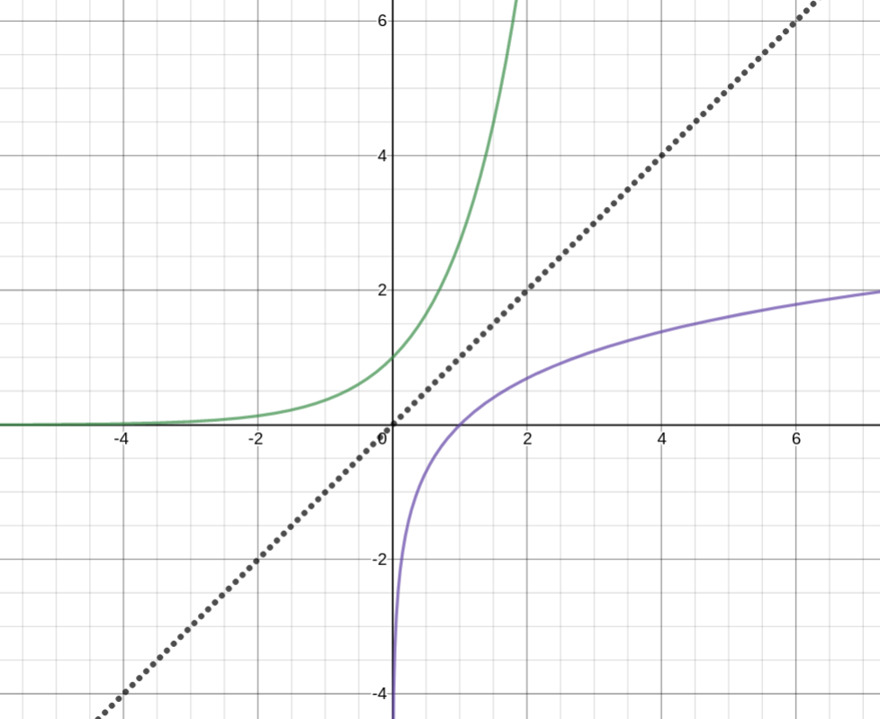

And the derivative of $\ln(x) = \frac{1}{x}$

$\lim_{x \to \infty} \ln (x) = \infty$
$\lim_{x \to 0^+} \ln (x) = -\infty$

**Theorem**

For $x>0$,  $\ln ' (x) = \frac{1}{x}$ so $\ln '' (x) = \left( \frac{1}{x} \right) ' = \frac{-1}{x^2}$

Therefore $\ln (x)$ is strictly increasing and is always concave down.

Proof by the inverse function theorem 

$f(x) = e^x$

$f'(x) = \ln x$ 

$\frac{d}{dx}\ln x = \left( f^{-1} \right)' (x) = \frac{1}{f'(f^{-1}(x))} = \frac{1}{f'(\ln x)}$ 

$f(x) = e^x$

$f'(x) = e^x$

$\frac{d}{dx} \ln x= \frac{1}{e^{\ln x}} = \frac{1}{x}$

Alternatively:

$f(x) = \ln x$

$f'(x) = e^x$ 

$\frac{d}{dx}e^x = \left( f^{-1} \right)' (x) = \frac{1}{f'(f^{-1}(x))} = \frac{1}{f'(e^x)} = e^x$ 

$f'(x) = \frac{1}{x}$

## Algebraic Properties of Logs

Consider the graphs $\ln x$ (in red) and $\ln (5x)$ (in blue)

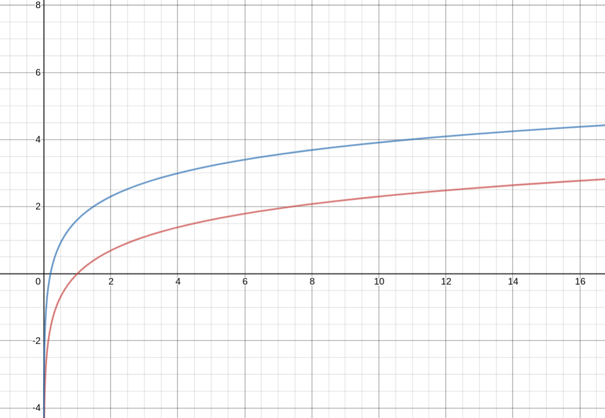

$y = f(x) = \ln x$

$f'(x) = \frac{1}{x}$

$y = g(x) = \ln 5x$

$g'(x) = \frac{1}{5x} * 5 = \frac{1}{x}$ 

They have the same slope

**The Properties**

1. if $x>0,\ \ln \frac{1}{x} = \ln x^{-1} = -\ln (x)$ 
2. For all $x>0$ and  $a>0$,  $\ln ax = \ln a + \ln x$ (NOT $(\ln a)(\ln b)$)
3. For all $x>0$ and $a>0$, $\ln \frac{a}{x} = \ln a - \ln x$ 
4. For $x>0$ and  $r$ rational, $\ln x^r = r\ln x$

## Logarithmic Differentiation

Steps:
1. Take logs of both sides
2. Differentiate both sides
3. Multiply both sides by $f(x)$

$f(x) = \ln (x^2 + 1)^{\frac{1}{2}} = \frac{1}{2} \ln(x^2 + 1)$ 

$f'(x) = \frac{1}{2} \frac{1}{x^2 + 1} 2x$

Given:

$y = f(x) = \frac{(x^2 + 1)^6 e^{5x^3-2x}}{\sqrt{x^4+7}}$
 
We want $f'(x)$

Recall $\ln (\frac{ab}{c}) = \ln a + \ln b - \ln c$

$\ln f(x) = 6\ln (x^2 + 1) + 5x^3 - 2x - \frac{1}{2} \ln(x^4) + 7$

$\frac{1}{f(x)} f'(x) = 6 * \frac{1}{x^2 + 1} 2x + 15x^2 - 2 - \frac{1}{2} \frac{1}{x^4 + 7} 4x^3$

$f'(x) = \frac{(x^2 + 1)^6 e^{5x^3-2x}}{(x^4 + 7)^{\frac{1}{2}}} \left( \frac{12x}{x^2 + 1} + 15x^2 - 2 - \frac{2x^3}{x^4+7} \right)$

**Example**

$f(x) = x^2$

$\ln(x) = 2\ln x$

$\frac{1}{f'(x)} = \frac{2}{x}$ 
 
$f'(x) = x^2 \frac{2}{x} = 2x$ 

**Example**

$y = \frac{x^5}{(1-10x)\sqrt{x^2+2}}$

$\ln y = 5\ln 5 - \ln (1-10x) - \frac{1}{2}\ln (x^2 +2)$

$\frac{1}{y} \frac{dy}{dx} = \frac{5}{x} - \frac{1}{1-10x} (-10) - \frac{1}{2} \frac{1}{x^2+2} 2x$

$\frac{dy}{dx} = \frac{x^5}{(1-10x)(\sqrt{x^2+2}} \left(\frac{5}{x} + \frac{10}{1-10x} - \frac{x}{x^2+2} \right)$

### Proving Rules Using Logarithmic Differentiation

**Product Rule**:

Given $y=f g$ where $f$ and $g$ are differentiable at $x$ find $y'$

$\ln y = \ln (f g) = \ln f + \ln g$

$\frac{1}{y} y' = \frac{1}{f}f'(x) + \frac{1}{g}g'(x)$ 

$y' = f g (\frac{1}{f} f'(x)) + f g (\frac{1}{g}g'(x))$

$y' = gf'(x) + fg'(x)$

**Quotient Rule**:

$y= \frac{f}{g}$

$\ln y = \ln f - \ln g$

$\frac{1}{y} y'(x) = \frac{1}{f}f'(x) - \frac{1}{g}g'(x)$

$y'(x) = \frac{f}{g} \frac{1}{f}f'(x) - \frac{f}{g} \frac{1}{g} g'(x)$

$y'(x) = \frac{f'(x)}{g} - \frac{f * f'(x)}{g^2}$

$y'(x) = \frac{f'(x)}{g} - \frac{f * f'(x)}{g^2}$

$y'(x) = \frac{g * f'(x)}{g^2} - \frac{f * f'(x)}{g^2}$

$y'(x) = \frac{g * f'(x) - f * f'(x)}{g^2}$ 

**Example**:

$y = \frac{\sqrt{x^2 - 11} }{x^6 \sqrt{x^2 + 5} }$
 
$\ln y = \frac{1}{2} \ln (x^2 - 11) - 6 \ln x - \frac{1}{2} \ln (x^2 + 5)$

$\frac{1}{y} y' = \frac{x}{x^2 - 11} - \frac{6}{x} - \frac{1}{x^2 + 5}$ 

$y' = \left( \frac{x}{x^2 - 11} - \frac{6}{x} - \frac{1}{x^2 + 5} \right) \left( \frac{\sqrt{x^2 -11} }{x^6 \sqrt{x^2 + 5} } \right)$ 

# 2.6 General Exponential and Logarithmic Functions

Define base $b$ exponential function $b^x$

$b^x = e^{x \ln b}$
 
Domain:  $(-\infty, \infty)$
Range:  $(0, \infty)$

## Properties:
$a,\ b > 0,\ x, y \text{Real}$
1. $b^0 = 1$
2. $b^{x+y} = b^x * b^y$ 
3. $b^{-x} = \frac{1}{x^x}$ 
4. $(b^x)^y = b^{xy}$
5. $\ln b^x = x \ln b$ 
6. $a^x * b^x = (ab)^x$

Derivative for  $b>0$

$(b^x)' = (e^{x \ln b})' = e^{x \ln b} * \ln b = b^x \ln b$ 

**Example**

Find the slope of $f(x) = 2^x$ at  $x=-2$,  $x=2$.

$f'(x) = 2^x \ln 2$ 

$f'(-2) = \frac{1}{4} \ln 2 \approx 0.017$

$f'(2) = 4 \ln 2 \approx 2.77$ 

**Example**:

$(\ln (3^t + 1))'$ 

$= \frac{3^t \ln 3}{3^t + 1}$ 

**Example**:

For $f(x) = x * 2^x$ find $f'(x)$, intervals of increasing and decreasing, and extreme values.

$f'(x) = 2^x + x 2^x \ln 2$

$f'(x) = 2^x (1 + x \ln 2) = 0$ 

$\therefore x = \frac{-1}{\ln 2} \approx -1.44$ 

Intervals:
* $(-\infty, \frac{-1}{\ln 2}) : f'(-2) = 2^{-2} (-2 \ln 2 + 1) < 0$ Decreasing
* $(\frac{-1}{\ln 2}, \infty) : f'(0) = 1+0 > 0$ Increasing

Therefore $x= \frac{-1}{\ln 2}$ is a global min.

$f(\frac{-1}{\ln 2}) = \frac{-1}{\ln 2} 2^{\frac{-1}{\ln 2}}$

$f(\frac{-1}{\ln 2}) = \frac{-1}{\ln 2} \frac{1}{e}$

$f(\frac{-1}{\ln 2}) = \frac{-1}{\ln 2 * e}$

### Second Derivative

$(b^x)'' = (b^x \ln b)' = \ln b (b^x \ln b) = (\ln b)^2 b^x$

For  $b>0$:
1. If $b=1$, $b^x = 1^x = 1$ 
2. If $b>1$, $b^x$ is strictly *increasing* and its graph is always concave *up*.
3. If $b<1$, $b^x$ is strictly *decreasing* an its graph is always concave *up*.

**Example**:

Radioactive Decay

$\frac{dA}{dt} = -k A$

$A(t) = A_o e^{-k t}$ 

When $t=t_{\frac{1}{2}}$ 

$A(t_{\frac{1}{2}}) = \frac{1}{2} A_o = \frac{A_o}{2} = A_o e^{-k t_{\frac{1}{2}}}$

$\ln (\frac{1}{2}) = \ln e^{-k t_{\frac{1}{2}}} = -k t_{\frac{1}{2}}$

$k = \frac{-\ln \frac{1}{2}}{t_{\frac{1}{2}}} $

$A(t) = A_o e^{\frac{-\ln 2 t}{t_{\frac{1}{2}}}}$

$A(t) = A_o e^{\ln 2^{-1} * \frac{t}{t_{0.5}}}$

$A(t) = A_o \left( \frac{1}{2} \right)^{\frac{t}{t_{0.5}}}$

Define the base $b$ log, $\log_{b}$ is the inverse function of $b^x$. So for all $x>0$, $b^{\log_b x} = x$
and for all $y$, $\log_b b^{y} = y$

### Converting to Base e

$\log_b x = \frac{\ln x}{\ln b}$ 

Check $\log_{10} 100 = \frac{\ln 100}{\ln 10} = \frac{2\ln 10}{\ln 10} = 2$

### Derivatives of Other Bases

$(\log_{b}{x})' = \frac{1}{\ln} \frac{1}{x} = \frac{1}{x \ln b}$ 

**Example**:

$(\log_{10}(x^2 + 1))' = \frac{1}{\ln 10} \frac{1}{x^2+1} * 2x = \frac{2x}{\ln 10 (x^2 + 1)}$ 

### General Power Rule

$\left( x^p \right) ' = px^{p-1}$

Proof:  $(x^p)' = (e^{p \ln x})' = e^{p \ln x} \frac{p}{x} = x^p \frac{p}{x} = px^{p-1}$

**Example**: ("General Power Exponential Rule")

Find the derivative of $g(x)^{f(x)}$ 

$(g(x)^{f(x)})' = e^{f(x) * \ln g(x)} = e^{f \ln g} (f * \frac{1}{g} g'(x) + \ln g * f'(x)) = g^{f-1} f g'(x) + g^f (\ln g) (f'(x))$

**Example** (#7):
 
$f(x) = (\log_{3}{x})^2$

$f'(x) = 2 (\log_{3} x) * \frac{1}{x \ln 3} = \frac{2 \log_{3} x}{x \ln 3}$ 

OR

$f(x) = \left( \frac{\ln x}{\ln 3} \right) ^2 = \frac{1}{(\ln 3) ^2} (\ln x)^2$

$f'(x) = \frac{1}{(\ln 3)^2} 2 \ln x \frac{1}{x} = \frac{2 \ln x}{x (\ln 3)^2} = \frac{2}{x \ln 3} \frac{\ln x}{\ln 3} = \frac{2 \log_{3} x}{x\ln 3}$

**Example** (#21):

Find intervals of increasing and decreasing and critical points for $f(x) = (x^2)^x$. 

$f'(x) = \ln f(x) = \ln (x^2)^x = x \ln (x^2)$ 

$\frac{1}{f} f'(x) = x \frac{1}{x^2} 2x + \ln x^2 * 1$

$f'(x) = (x^2)^x (2 + \ln x^2)$

Critical points are  $x=0$ and  $2+\ln x^2 = 0$

$x^2 = \frac{1}{e^2}$ 

$x =  \pm \frac{1}{e}$ are other critical points

**Example** (#16):

$p(x) = 12^{x \ln x} = e^{\ln 12^{x \ln x}} = e^{x \ln x \ln 12}$

$p'(x) = e^{x \ln x \ln 12} * \ln 12 (x \frac{1}{x} + \ln x * 1) = 12^{x \ln x} \ln 12 (1+ \ln x)$

NOTE: $x^{x \ln 12} = 12^{x \ln x}$

# 2.7 Trig Functions: Sine and Cosine

$f(x) = f(x-p) = f(x+p)$

$p>0$ and $p$ is the period of the function.

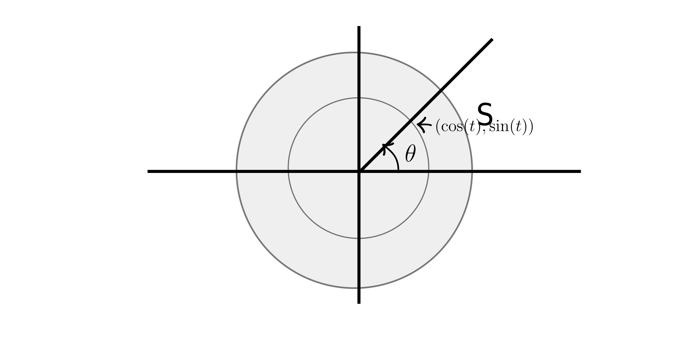

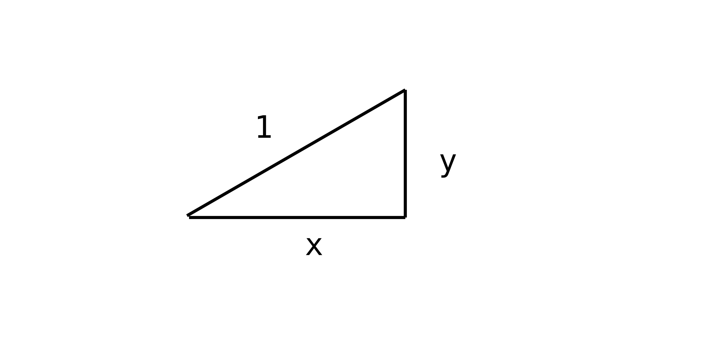

$s = r \theta$

Where the radius of the circle is $r$

By *similarity angle* $\theta = \frac{s}{r} = \frac{t}{1}$ 

$C = 2\pi r$

### Properties
1. For all $t$,  $\sin ^2 t + \cos ^2 t = 1$ 
2. sine + cosine are periodic with a period of $2\pi$ and for integers  $k$, $\sin t = \sin (t + 2\pi k)$ and  $\cos t = \cos (t + 2\pi k)$ 
3. $\sin (-t) = - \sin t$ (odd function ) and  $\cos (-t) = \cos t$ (even function)
4. Angle addition $\sin (\alpha + \beta) = \sin (\alpha) \cos (\beta) + \sin(\beta) \cos (\alpha)$ and  $\cos (\alpha + \beta) = \cos (\alpha) \cos (\beta) - \sin (\alpha) \sin (\beta)$ 
5. Double angles: $\sin (2 \alpha) = 2 \sin(\alpha) \cos (\alpha)$ and  $\cos (2 \alpha) = 2 \cos^2 (\alpha) - \sin ^2 (\alpha) = 2 \cos ^2 (\alpha) - 1 = 1 - 2 \sin ^2 (\alpha)$
6. For all  $\alpha$, $\sin (\alpha) = \cos (\frac{\pi}{2} - \alpha)$ and $\cos (\alpha) = \sin (\frac{\pi}{2} - \alpha)$ 

$\sin(t)$
* $t=0: 0$
* $t=\frac{\pi}{6}: \frac{1}{2} $ 
* $t=\frac{\pi}{4}: \frac{\sqrt{2} }{2}$ 
* $t=\frac{\pi}{3}: \frac{\sqrt{3} }{2}$ 
* $t=\frac{\pi}{2}: 1$

$\cos(t)$ 
* $t=0: 1$
* $t=\frac{\pi}{6}: \frac{\sqrt{3}}{2} $ 
* $t=\frac{\pi}{4}: \frac{\sqrt{2}}{2}$ 
* $t=\frac{\pi}{3}: \frac{1}{2}$ 
* $t=\frac{\pi}{2}: 0$

$y=\sin (x)$

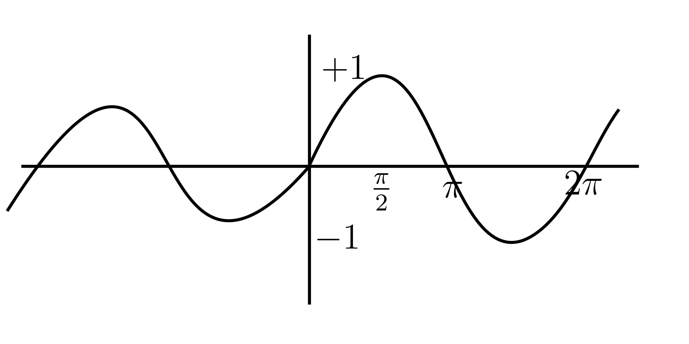

$y=\cos (x)$

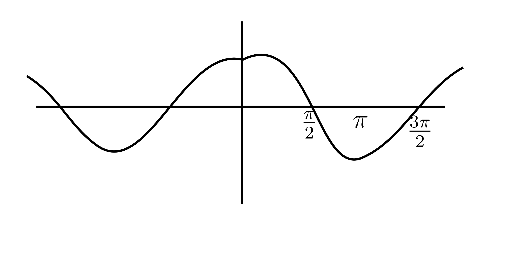

## Theorem

**Derivatives**
* $\sin'(x) = \cos(x)$
* $\cos'(x) = -\sin(x)$ 

**Second Derivatives**
* $\sin''(x) = - \sin(x)$
*  $\cos''(x) = -\cos(x)$

Consider the 2nd order differential equation

$y'' + y = 0$

Has salutations $y=\sin(x)$ and  $y=\cos(x)$

**Example**:

$z= r \sin (5r)$ 

Find $\frac{dz}{dr}$

$= 5r \cos(5r) + \sin(5r)$

**Example**:

$w_1 = e^{\cos (u^2)}$ 

Find $\frac{dw_1}{du}$

$=-\sin(u^2) 2u e^{\cos(u^2)}$

**Example**:

$w_2 = e^{\cos ^2 (4u)}$ 

Find $\frac{dw_2}{du}$

$=e^{\cos^2 (4u)} 2 \cos (4u) (-\sin(4u) 4$

**Example**:

Calculate $(\ln \cos (3x))'$

$= \frac{1}{\cos (3x)} -\sin (3x) 3$

**Example**:

Calculate $(5 \cos (2x) + \frac{\sin x^2}{x})'$

$= 5 -\sin (2x) 2 + \frac{x \cos (x^2) 2x - \sin (x^2)}{x^2}$

**Example: Simple Harmonic Oscillator**

At $t$ seconds, the position of the block is $x=2\cos(3t)$

Find:
1. $x$, $v$, and $a$ of the block at $t=0$ and $t=\frac{\pi}{2}$s
2. When will the block return to where it started?
3. When will it reach maximum displacement?
4. What happens after a long time?

$x=2 \cos(3t)$

$v=-6\sin(3t)$

$a=-18 \cos(3t)$

It returns when $3t = 2\pi$, therefore  $t= \frac{2\pi}{3}$ 

It reaches maximum displacement when the derivative is zero.
