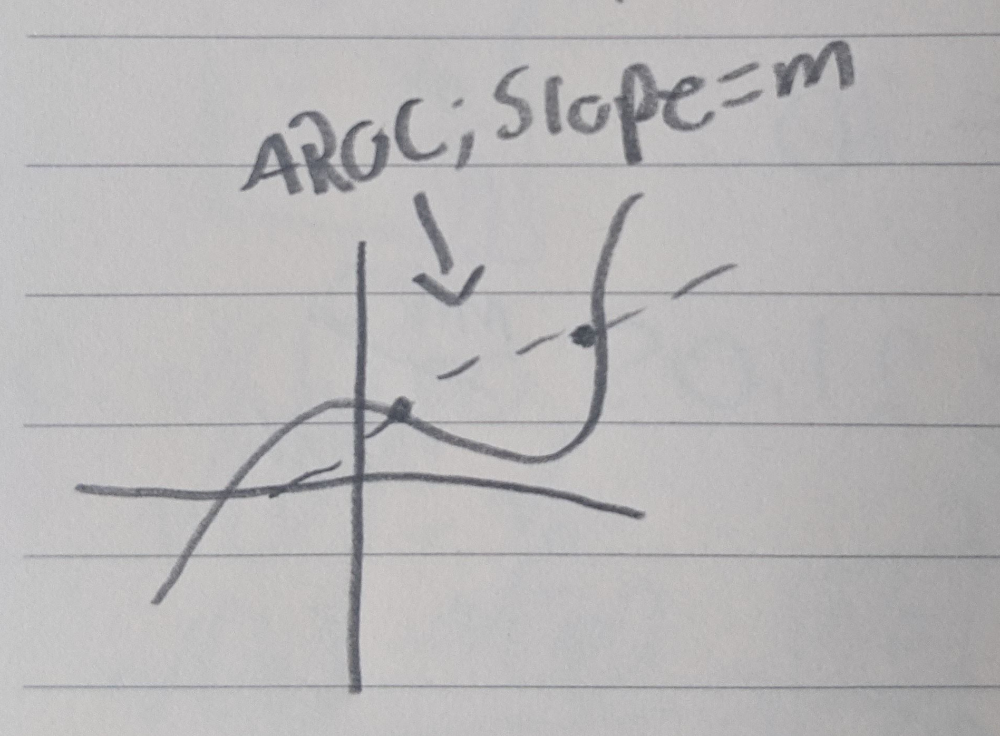
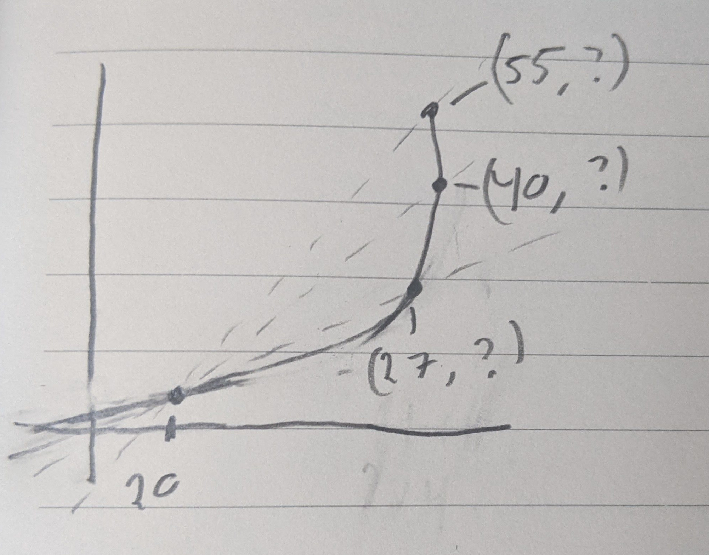

# The Class

Does not collect homework, however, the quizzes build off the homework
assignments. Some sections--about 5--of the homework will be collected and make up of the
5%. Will be graded for completeness.

First quiz will be next Wednesday (the 27th)

This class has a midterm and a final

# Rates of Change and the Derivative

## Average Rate of Change
**Example 1:**

What is the (average) velocity during the 2 min?
$\text{avg v} = \frac{\Delta P}{\Delta t} = \frac{1\text{mile}}{\frac{1}{30}h} =
30 mph?$

Speedometer: instantaneous velocity 

We will be the average rate of change to approximate the instantaneous rate of
change.

AROC (average rate of change) for $f$ with respect to (wrt) $x$ between $x=a$
and $x=b$ or interval $[a,b]$ where $a<b$.

$\frac{\Delta y}{\Delta x} = \frac{\Delta f}{\Delta x} = \frac{f(b)-f(a)}{b-a}$ 

This is called the *difference quotient*.

**Example 2:**

At times $t=0,\ 1\ 5$ hours, the car is moving  $v=30,\ 60,\ 40\ mph$
respectively  what are the accelerations between $[0,1],\ [0,5],\ [1,5]$?

**Recall**: Average acceleration  $= \frac{\Delta v}{\Delta t}$

$[0,1]\ a_1=\frac{v(1)-v(0)}{1-0}= \frac{60-30}{1} = 30mph$ 

$[0,5]\ a_2 = \frac{v(5)-v(0)}{5-0} = \frac{40-30}{5-0} = 2mph$ 

$[1,5]\ a_3 = \frac{v(5)-v(1)}{5-1} = \frac{40-60}{5-1} = \frac{-20}{4} = -5mph$

**Example 3:**

What is the AROC of area, $A$, in in$^2$ of 16:9 widescreen TV wrt the
diagonal? $d$ (diagonal) between d=32 in d=40in and 40in and 52in?

To solve this, we want $A(d)$ 

Then we will find $\frac{\Delta A}{\Delta d}$

$A = 16x \times 9x = 337x^{2}$

$(9x)^{2}+(16x)^{2} = d^{2}$
 
$\therefore 337x^{2} = d^{2}$
 
$A(d) = \frac{144}{337}d^{2}$

We want $\frac{\Delta A}{\Delta d}$ from [32, 40]

$\frac{\Delta A}{\Delta d} = \frac{A(40) - A(32)}{40-32}$

$\frac{\Delta A}{\Delta d} = \frac{\frac{144}{337}(40^{2}-32^{2})}{8} =
\frac{144}{337} * 72 \approx 30.7 \frac{in^2}{in}$

Now do $\frac{\Delta A}{\Delta d}$ from [40, 52]

$\frac{\Delta A}{\Delta d} = \frac{A(52) - A(40)}{52-40} =
\frac{\frac{144}{337}(52^2-42^2)}{12} \approx 39.31 \frac{in^2}{in}$

Because these numbers are different for the different ranges, we know that it is
dependent on the diagonal.

Ex. 1.1.8

$y=f(x)=4-x^{2}$ 

What is the AROC of $y$ wrt $x$ on [1,2]

$\frac{\Delta y}{\Delta x} = \frac{\Delta f}{\Delta x} = \frac{f(2) - f(1)}{2-1}$ 
$= \frac{(4-2^{2}) - (4-1^{2})}{1} = \frac{0-3}{1}=-3$

### Def. 1.1.9 - Secant Line

For function $y=f(x)$ and two x values $a$ and $b$. We will define the *secant
line* of $f$ as the line through the points (a, f(a)) and (b, f(b))

### Prop 1.1.10 - Slope of Secant Line

Given $y=f(x)$ and $a<b$ the AROC of $f$ on [a,b] is the slope of the secant
line of $f$ for $x=a$ and $x=b$. 

## Instantaneous Rates of Change

Suppose we want the car's velocity at t=12 min?

If $v = \frac{\Delta p}{\Delta t}$ 

Solution take average between $t=a$ and $t=a+h$ and let $h$ go to 0.

### Def. 1.2.3 - Limit Definition of Derivative
Given $y=f(x)$, the new function $f'$ which is given by 
$f'(x) = \lim_{\Delta x \to 0} \frac{f(x+\Delta x) - f(x)}{\Delta x} $

$f'(x) = \lim_{h \to 0} \frac{f(x+h) - f(x)}{h}$ 

This is called the derivative of $f$ with respect to $x$ and is the
**instantaneous rate of change** for any value of $x$ for which the limit
exists. This means that if the limit does not exist, the derivative does not
either.

**Ex. 1.2.2**

Recall the 16:9 TV example above.

$A(d) = \frac{144}{337}d^{2}$

What is the derivative (or IROC) of $A$ wrt to $d$ when $d=40in$?

$A'(d) = \lim_{h \to 0} \frac{A(d+h) - A(d)}{h}$ 

$= \lim_{h \to 0} \frac{\frac{144}{337}(d+h)^{2} - \frac{144}{337}d^{2}}{h}$
$= \lim_{h \to 0} \frac{144}{337} \frac{d^{2}+2dh+h^{2} - d^{2}}{h}$ 

$A'(d) = \lim_{h \to 0} \frac{144}{337} \frac{h(2d+h)}{h} = \frac{144}{337} 2d$

$A'(40) = \frac{144}{337} 2(40) \approx 34.2 \frac{in^{2}}{in}$ 

**Secant Line**:

Consider a function with secant-lines (20, 55), (22,40), (20, 27)

The smaller the interval, the closer it becomes to the instantaneous rate of
change.

Recall: $A'(d) = \frac{144}{337} 2d$

IROC of $A$ wrt $d$ at 20, $A(20)$=tangent to the graph at that point.

What is the equation of the tangent line?

$A(20) = A'(20)(d-20)$
$A-170.92 = 17.09(d-20)$

Recall:
### Point-slope Form
$y-y_1 = f'(x_1)(x-x_1)$

Given particle with position $p(t) = \frac{1}{\sqrt{t}}$ for $t>0$ what the
velocity?

$p'(t) = v(t) = \lim_{h \to 0} \frac{p(t+h)-p(t)}{h}$ 
$= \lim_{h \to 0} \frac{\frac{1}{\sqrt{t+h} }-\frac{1}{\sqrt{t}}}{h}$ 

$p'(t) = \lim_{h \to 0} \frac{\frac{1 * \sqrt{t}}{\sqrt{t+h} * \sqrt{t}}- \frac{1 * \sqrt{t+h} }{\sqrt{t} \sqrt{t+h} }}{h}$

$p'(t) = \lim_{h \to 0} \frac{1}{h} \frac{\sqrt{t} -\sqrt{t+h} }{\sqrt{t+h} \sqrt{t} } \frac{\sqrt{t} + \sqrt{t+h} }{\sqrt{t} +\sqrt{t+h} }$

$p'(t) = \lim_{h \to 0} \frac{1}{h} \frac{t-(t+h)}{\sqrt{t+h} \sqrt{t} (\sqrt{t} + \sqrt{t+h} )}$

$p'(t) = \frac{-1}{t * 2 * \sqrt{t} }$
