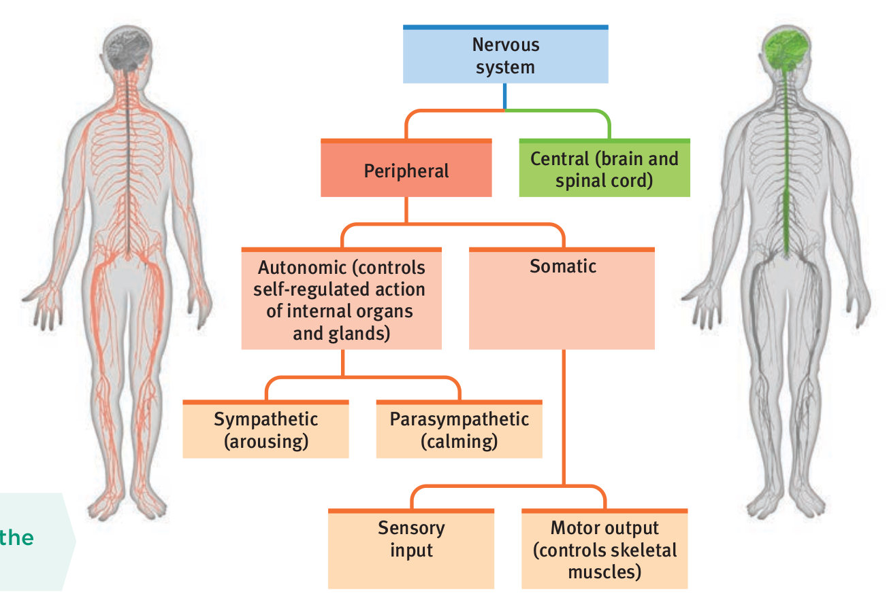
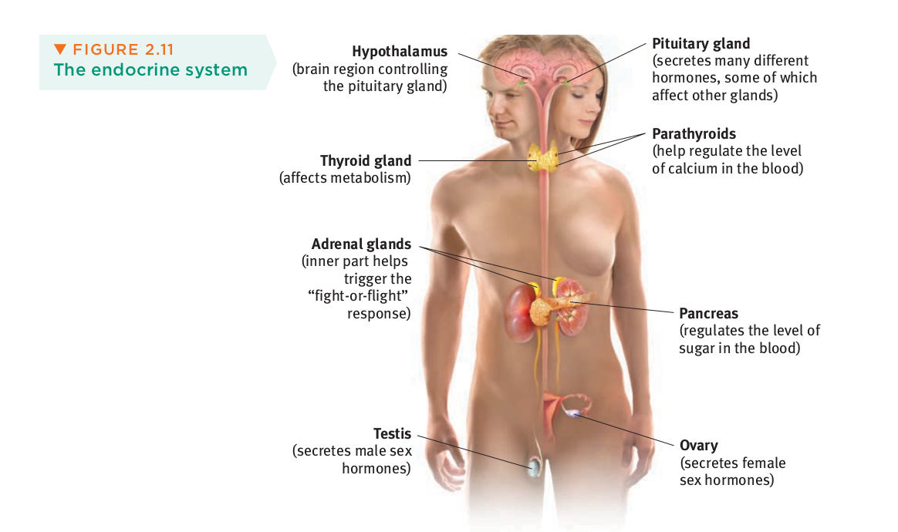
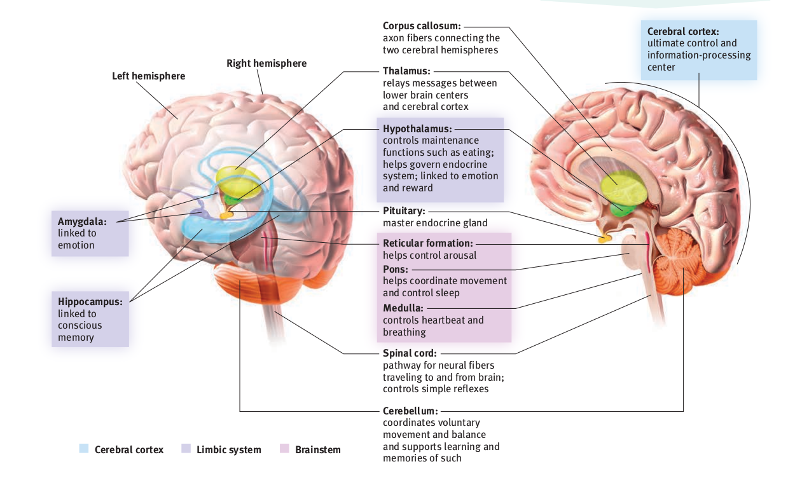
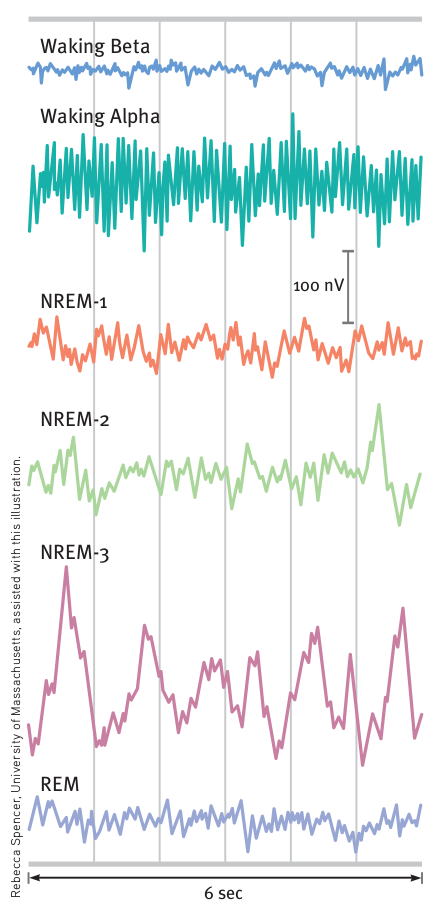
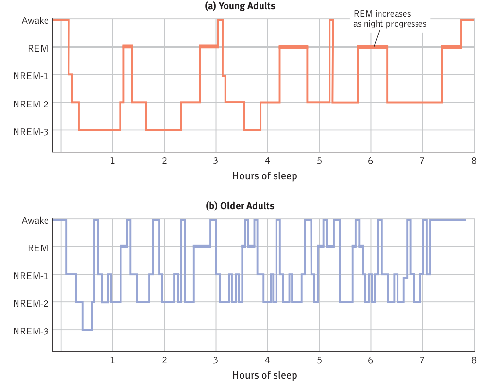
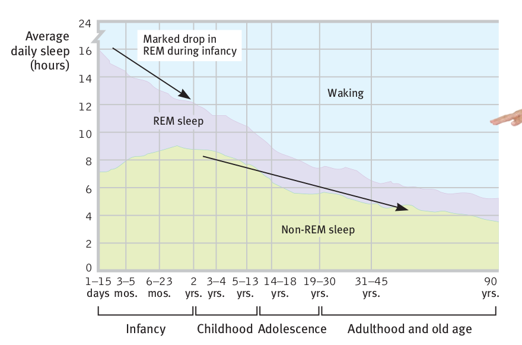

# The Class
What will we cover during this semester?
* This is a surface-level class

This class is hard in *quantity* not *quality*

The textbook has great time management advice in the preface

Office Hours
* Email to schedule

Midterms
* Tuesday, February 9th
* Tuesday, March 9th
* Friday April 2nd

Media Assignments
* You have 2 weeks to respond to the media

Bigger Assignments
* 6 More substantial assignments
    * First two graded by DrAkula
    * The rest will be graded by peers

Most people don't finish PhDs
* Some PhD programs offers a masters degree along the way (often 2 years)

A doctorate is *required* to be a clinical psychologist

Psychometric psychologists
* Studying the methods used by other psychologists
* Devise new approaches to psychological research

How to Get into Graduate Study in Psychology
* Do research
    * It will be mundane at first, but stick with it
    * Ask to be a co-author on the publication of the work
* Go to functions
    * If you're doing research, try to attend meetings and present your work.
    * Go to colloquia
    * Join Psi Chi

* Do a co-op in DrAkula's lab
    * Have a 100% track record of co-ops getting into graduate school

You *must* complete 3 credits of research participation in order to pass the
course.

**Research**

Username: First and last name

Password: nine-digit student id

**Midterm**:

The exam will be 100 minutes

Average is approx 45 minutes

* The Prologue 
* Appendix B,
* Chapters 1-4

Go through the **learning objectives**

Go through the vocabulary words in the textbook.

Do the multi-media assignments

[Midterm 1](/notes/psyc1101/midterm1)

# Introduction and Overview

What is psychology? A science
* 300 BC: Aristotle thinks about thinking (introspection)
* 1653 "study of the soul" (Philipp Melanchthon)
* Predict the behaviors of and explain the motivations of and manipulate the
  emotions of people

Humanist Psychology
* Maslow: need to help humans

Psychology's Biggest Question:
* Nature vs. Nurture
    * Biology vs. Environment and experience.
    * Nurture works on what nature endows

Levels of Analysis
* In order to answer a question, you must first decide which level you want to
  answer it on
    * The big 3: Biological, psychological, social-cultural

Apple is a *human factors* company
* When they make a feature, it is very easy to use which makes them a very
  valuable company

# The Scientific Method

There are three types of lies: lies, damned lies, and *statistics*.

Ex. You need to run trials before you can put your drug out there. And it needs to be statistically better than what's already out there.

## Statistics

On the air you can say a extreme lies (ex. "mile high pie"), but you can't say a lie that sounds reasonable (ex. "8-inch-high-pie)--unless it's true.

How things are presented make a huge difference.

Every time you simplify a finding, you sacrifice completeness
* Ex: Averages

### Averages
* Mean - Typically the arithmetic average.
* Median - 50th percentile, or middle number of a rank-ordered sequence
* Mode - Most commonly occurring value
* The Middle - The mean of the high and low end

### Bias

Bias in data means that a result will tend to be reported as either too high or too low.

The bell curve or *normal distribution curve* represents a population.

The mean and median can often not tell the same story: for example, if all of us have 5 dollars and one person walks in with 500 dollars and steals our money, the median went down and the mean went up.

### Variability

Variability is great is sports, but bad everywhere else. Averages derived from scores with low variability are more reliable than averages based on scores with high variability.

### Standard Deviations

Means and Standard Deviations are descriptives. They tell us about data.

When we calculate test statistics to decide if a difference is *meaningful*, we want to be sure that it is
* If we are 95% sure, then we say a difference is "significant"

The *central limit theorem* states that the distribution of the estimates of the *mean* drawn from any population -- even one that is not normally distributed -- will be approximately normally distributed if the sample is sufficiently large.
* We want the values to fall outside of the lines in a distributions like these so that we are 95% sure 

Saying that an effect is significant doesn't mean that the effect is large, only that we are certain that it exists.

The SD of the means that we would get if we kept sampling the population is called the standard error of of the mean (SEM).

The SEM decreases with the square root of sample size ($n$):

$SEM = \frac{SD}{\sqrt{n}}$ 

Thus, we get diminishing returns with increasing sample size.
* More is better, but every 1 added is less and less important

The population of your sample is very important

### Correlations

Correlations are defined by a coefficient called Pearson's Product Moment and abbreviated "r".
* $r$ can range from -1 to 1.
* The closer the magnitude of $r$ is to +/- 1, the more it is correlated

The square of $r$ is often taken as a measure of the proportion of the variability of one parameter.
* Ex. If the $r$ value of IQ and academic achievement is 0.5, then IQ makes up about 25% of your academic achievement 

Correlation is the *only* thing to imply causation.

If an off correlation holds up over repeated studies, however, it *is* probably causal somehow.

Correlations are really sensitive to outliers

### Hindsight Bias

Hindsight bias is the phenomenon of seeing an event that already occurred as being easily predictable when, in fact, before it happened, it was not.
* This is a major issue in law: Amazon is the only Web vendor with "one click shopping." Obvious?
    * It is *now*

We also have a tendency to be overconfident. We must be:
* Curious,
* Skeptical, and
* Humble.

### Case Studies

Studying an individual or group to study a population of a whole.

For example, if a blind person is missing a part of their brain, then we can hypothesize that that part of the brain is responsible for seeing.

The plural of anecdotes is *not* results--but it is data.

### Experiments

In an experiment we typically have
* A control group, and
* One or more experimental groups 

Independent Variables - The factor that is manipulated
Dependent Variables - The factor that in (possibly) influenced by the Independent Variable

There are always bias; the best of us cannot help but insert our values into the interpretation.

### Ethics

We prioritize human health and happiness over that of animals. But what is the right balance?

The APA recommends that scientists:
* Obtain informed consent,
* Make efforts to protect their subjects from pain or discomfort
* Keep identifying information confidential, and
* Debrief.

# Psychobiology

There is a biological reason for everything psychological.

In order to understand a system, you need a more complicated system. Therefore, it's hard to understand the brain with the brain.

"I think therefore I am"
* Meaning if we are in the Matrix, you'd still exist

The fundamental unit is the nervous system with the cell the fundamental unit of that.

## Neuron
**Neuron**: A nerve cell. A cell with a synapse.

We say a cell is hyper polarized if it is *more negative* than usual

We say a cell is depolarized if it is *less* negative than usual*

The language of neurons is both electric and biological.

### Synapse

The neurotransmitter acts like a "key" with special chemical "locks" called receptors.

### Neurotransmitters

Acetylcholine (ACh)
* Handles movement

Morphine
* Alleviating pain and inducing euphoria

Synthetic Neurotransmitter
* Creating artificial "keys" to unlock the "lock"
* Either creates an exact key OR close enough to jam the lock so the real key can't get in

## Nervous System

Central Nervous System (CNS)
* The brain and the spine
Peripheral Nervous System (PNS)
* Everything else

Nerves are bundles of axons

Nerves
* Sensory
    * Carry messages from the sense organs to the brain or spine for processing
* Motor
* Carry signals from the CNS to the muscles and organs
* Interneurons
    * These are all those neurons between sensory and motor neurons (most neurons are interneurons)

### PNS: Somatic Nervous System
The somatic nervous system  in the concious part -- you have concious control (ex. Limbs).

### ANS: Automatic Nervous System
Unconscious functions (ex. Heart rate). However, this is a fuzzy line.

### CNS: Central Nervous System
"You" are your brain 

"Ascending" signals are signals to the brain
"Descending" signals are from the brain 

### The Endocrine System
It "sets the tone"

Signals set by the endocrine system linger in the blood explains why feelings linger.

## The Brain

### The Old Brain
Instinctual impulses. We call it the old brain because it is present in (most) other animals.
* Breathing
* Heart-rate
* etc.

### The Limbic System 
* The amygdala (Very important)
    * Handles fear and emotions
* The hypothalamus - reward center of the brain. Activated, rats will pass out pushing a lever to stimulate the hypothalamus.
    * Thirst 
    * Hunger
    * and Sexual behavior

## The New Brain
Handles conciousness

### The Cerebellum ("The Little Brain")
Handles motor functions

### The Cerebral Cortex

**Frontal Lobe**: Planning and thinking through actions

We know what certain parts of the brain by case studying of people who are missing that part of the brain.

For example, the frontal lobe is connected with planning and emotions.

Motor cortex, sensory cortex

**Association Areas**:

More than $\frac{3}{4}$th of the cortex is *not* one of those regions that receives direct sensory input or sends motor output. These areas are called *association areas*.

**Visual and Auditory Cortex**: Handles audio and visuals in a very organized manner

### Brain-Computer Interfaces
By using EEG, fMRI, or implanted electrodes, we can "eavesdrop" into what's going on inside a living person's brain.

---
The first writing assignment is due next Wednesday (February 3rd)
* Which movie is funnier, *Airplane!* or *The Holy Grail?*.
* Imagine a research project that you could conduct yourself
* What is your operational definition of funny
    * For this purpose of this project, this means funny

1. Explain the problem to be addressed
2. Operationalize the variables under study, and
3. Outline the statistical approach that will be used to test the hypothesis.

---

### Plasticity

Describes the ability of the CNS to change as a result of insult or experience 

Plasticity underpins the observation that the blind may appear to have keener hearing than the sighted.

Similarly, if a blind person reads braille with one finger, the part of the brain used for vision is not used for that finger.

Conclusion:
* Use it or lose it
    * If you don't use a certain part of your brain, it will take on a different purpose

### The Divided Brain

**The Right Brain**: is more so the animal brain -- not very good at logic. Ex. Artistic creativity.

**The Left Brain**: More logic focused

Our brain is split and information is processed through the **corpus callosum**.

People with severed corpus callosum's are given a screen to look at that says "HE*ART".
* When asked to speak (left side processes) the word, they said "ART"
* When asked to point at the word (right side process), they pointed at "HE"

### Language 

Reading, writing, speaking, singing. All are language skills.

**Broca's Area**
* In the frontal lobe, is critical for speech generation.

**Wernicke's Area**
In the temporal lobe, is essential for generation cohererent speech 

**The Angular Gyrus**:
* In the parietal lobe, is requires for the processing of auditory input

## The Nervous System II

People with isolated damage to the brain can 'see' without being aware of the sight.
* You can respond to things without being *aware* of them

**Parallel processing**: What your brain handles on its own (ex. Going for a walk.)

**Serial Processing**: Your concious thought (ex. 5+12)

Attention -- serial processing -- is selective. You can only focus on one thing at once.
* It's hard to split your attention
* Ex. With gorilla basketball experiment

### Cognitive Blindness 
The gorilla basketball experiment and distracted driving are cases of *inattentional* blindness.

**Change bias**: The idea that the brain can miss seemingly obvious, big changes.
* Switching experiment instructors and people didn't notice that they were two different people

### Circadian Rhythm and Sleep

The SCN is our 'biological clock' that regulates your alertness and sleep

Before the age of 20, we are night owls

After 20, we are early birds

Falling asleep is actually an instantaneous process -- there is no 'half asleep'.

Here are the stages of sleep:

Here are the stages throughout the night:

The light bulb messes up our *circadian rhythm*.

Throughout our lives, our sleep changes:

**REM rebound**:

After sleep depravation, people have more REM sleep once they get sleep, indicating that it is the most important stage.

**Sleep Loss**

20% of high school students say that they fall asleep in class at least once a week

~60% of high school and college students are sleep deprived

Risks of lack of sleep:
* Shorter life
* Higher blood pressure
* Less stress
* Etc.

You also perform better driving.

**Insomnia**: Is the *persistent* difficulty with falling or staying asleep. Drugs and alcohol is bad to self-medicate. Instead try:
* Exercise,
* Cutting back on caffeine, 
* Turning down the lights
* Practicing relaxation 

**Apnea**: A period, up to a minute, where sleepers fail to breathe. They are then "jerked" awake by snoring.

**Narcolepsy**: The sufferer is overcome by overwhelming sleepiness. They often occur at very inopportune times, such as after exerting oneself by
* Laughing
* Playing sports
* Etc.

**Night Terrors**: Disease of children. Young children will awaken, talk incoherently and experience rapid heart and breathing rates. Typically, they do not remember anything in the morning. They are not in REM sleep which means that they are not dreams.

**Sleepwalking/talking**: Sleepwalkers are also usually children. It is genetic. They are also not typically acting out their dreams.

### Dreams

We now know when someone is dreaming (during REM sleep).

* After a trauma, people tend to have nightmares. 
* Musicians dream frequently of music. 

We are not concious when we dream, our unconscious minds are still running.

People are still aware of things that are going on:
* Spraying someone with mist will often cause them to dream about water

Dreams do *not* act as metaphors for our life's problems.

We often rehearse the things that we did throughout the day in our dreams.

The amygdala determines and holds what is emotionally important.

Dreams are the result of our brain's 'housekeeping' at night.

## Psychoactive Drugs

People who drink more, *can* drink more. This is because people develop **tolerance**.

As tolerance increase, people increase their dose (to get the same result). As you increase your tolerance, you experience withdraws. 

**Dependence**:

There are two different dependencies: physical and psychological. As the name implies, physical dependencies cause physical discomfort.

We may be dependent on many things:
* Smartphones
* Exercise
* Sex
* Work
* etc.

But these aren't *addictions*. We shouldn't overstate or understate the dangers of drugs. Addictive substances aren't necessarily going to ruin you. People also overcome addiction very frequently. There are more ex-smokers than smoking.

But addiction is still the leading cause of accidental death in the US.

There are three different types of drugs:
* Depressants
* Stimulants 
* Hallucinogenics 

**Depressants**:

Most common depressant is alcohol. The first thing to go is your frontal lobe -- effects of reasoning. Slows down your body -- slows down the fight-or-flight.

You forget what happens when you are drunk. When you are drunk, you can't have REM sleep and therefore you can't store things into your long-term memories. Drinking itself isn't bad, but drinking *can* be dangerous if done unsafely.

Opioids:

Ex: opium, herion, and morphine

If you build a dependence, your body stops making its own.

**Stimulants**:
* Stay awake
* etc.

Caffeine ranks as an #1 in the stimulant category. Withdraw includes headaches.

Meth:

Stopping using meth, you get strong withdrawl symptoms.

Nicotine:

Kills a lot of people per year -- a holocaust worth of people at its peak.

More addictive than heroin or cocaine.

Cocaine:

"Quick high"
* The euphoria lasts about 15 minutes
* By 20 minutes, the user becomes agitated.

It blocks the reuptake of dopamine so it stays in the synapse.

Ecstasy: 

Very deadly

**Hallucinogens**:

LSD:

Distorts perceptions and evokes sensory images in the absence of sensory input.

Marijuana:

People often don't get high on the first hit.

# The Mind

What is the mind?

What is consciousness? 
* It's not fixed -- you can become unconscious 

The most important question in psychology and biology is *why*?

We have *two minds*:
* the one we are aware on, and
* the one we are not

Our conciousness does not make decisions. Our ideas are merely rationalized *post hoc*. 

D.F. Lost her concious sight, but could still see -- she moved out of the way of objects.

# Nature vs. Nurture

The Road Not Taken by Robert Frost
* What does the data say about the choices we make?

## Are Our Genes Our Fate?

People are mostly the same across the world
* We are very similar genetically

20,000 coding genes in our DNA

Most of our DNA is *dark*.

But to what extent to these differences change who we are?

A single nucleotide (A, C, T, or G) can be lost, added, or replaced which is called *mutation*.

We haven't identified most of what individuals genes do.

The function of genes can change.

Epigenetic phenomena can alter which genes are or are not expressed.

We can't experiment differing genes on humans so we study **twins** and **adoption**.

We study identical twins who grow up in different environments. And fraternal twins in the same household. We then can get all four of the possibilities to study nature vs. nurture.

We don't have random grouping in these studies! Identical twins most of the time don't have *exactly* the same genes.

Identical twins are, however, very alike. Are our genes our fate? *Yes -- well sort-of*.

Siblings are only slightly more alike than two kids from the same neighborhood.

Adopted children have more personality traits from their biological parents then their adopted parents.

If this is true, what traits are most heritable? 
* Temperament
    * Children who are shy will likely be introverted as teens
    * Emotionally intense preschoolers are most emotionally intense at college students
* Addiction
    * Both environment and genes play a role

What *aren't* environment:
* Personality is both nature and nurture.

Nurture acts on what nature endows. "Nature *via* nurture".

What things are nurture:
* Value systems
    * Political and religious attitudes
* Social interactions
    * Personal manners
    * How charitable you are 
* Education
    * Nurture can control the quality of school you attend
    * However, its the genes that control the quantity 

<5% of all differences among humans arise from population group differences.

>95% of genetic variation exists within populations.

Because we are similar genes, we therefore have similar personalities. These have been *evolutionary conserved*. We haven't changed all that much from the first humans. Modern humans are the same:
* Fear of snakes and heights
* We share a universal moral code
* Less likely to murder our biological children 

## Gender and Sex Differences

For women, passing on their genes is a literal "labor of love".
* Women have small number of children but focus on quality

Men have this option, but also have the option to have a lot of children and don't have to care about them.

These lead to fundamental differences in the thought of sex between men and women.

Women prefer potential "dads".

Men prefer peak fertility (around the age of 20).

Men want sex more than women; is this biology or social norms?
* Both

Men tend to be more
* Dominant 
* Directive

Women tend to be more
* More pluralist
* Supportive

These differences start in the playground
* Boys play in large groups with a goal
* Girls play in a small groups and tend to imitate adult social relationships

Men enjoy working on tasks together

Women tend to enjoy exploring relationships and use conversation to do this

Women do most of the housework, shopping, childcare

Women are the emotional strength in the family

There are differences in the brain, too.
* The part of the brain that handles verbal fluency are thinker in women
* The part of the cortex involved in spacial perception is thinker in men

Males have two X chromosome (one from mother and father).

Females have an X chromosome from their mother and a Y chromosome from their father.

The brains of both genders differ in utero. 

## Parenting and Personality

The principle of the brain: "use it or lose it".

Parents control what their kids, in large part, do with their daily lives.

Enriched environments makes rats more adventurous and vice versa.

Parents *do* matter. By reinforcing positive and negative behaviors, they can exploit the brain's plasticity to "widen" some paths and "narrow" some others.
* The effects of parents are only important at the margins.

Your peer group determine your personality more than your parents.
* Accents most resemble your peers, not your parents.

Parents, however, determine your value system.

Things that aren't in the parents' control:
* Level of education attained,
* Earning power,
* Intelligence,
* etc.

Bad parenting has been blamed for a lot of mental diseases, however, this isn't true.

Culture obviously impacts parenting

Parents in individualist cultures teach:
* Be yourself

Parents in collectivist cultures teach:
* Respect your elders

## Culture and Personality

Language has helped us our preform other animals.

A feature of culture is how rapidly they are able to change.

Cultures differ in how they value the individual vs how they value the group.

The United States is primarily individualist.
* We are culturally free

We value:
* Freedom
* Independence, and
* Individuality
* Privacy

Cons:
* Greater reports of loneliness 
* More divorce
* More stress
* More suicide

Asian and African countries are primarily collectivists.

Members of these cultures tend to:
* Lost their feeling of self when cut off from a specific culture
* Get value from their groups
* Fitting in is really important

# Development

**Exam Review**:
What is *my* definition of a neuron?
* Synapses

Split brain patient is shown a dog on the left and a boy on the right.

What will they say?
* Boy

What will they point to?
* Dog with left hand

### NUpath Assignment II

The advent of social media and the rise of women as economic and political forces have led to increased scrutiny of power dynamics in professional, interpersonal relationships.

Relationships between employees and students is not forbidden unless there is a power dynamic.

Do you agree with this policy? (150 words)
* Use a human cognitive development argument 

## Parental Development

  

  What is a fertilized egg called?
  

  
  zygote

Gestation begins about 10 days after conception and lasts for ~37 weeks.
* We typically call term 40 weeks

  

  Where does the placenta from from?
  

  
  Zygote

Alcohol and pregnancy
* Can lead to fetal alcohol syndrome
* Symptoms are male proportioned head
* The fetus can like the smell of alcohol

What do new-borns know?
* They aren't truly blank slates
    * We know how to suck
* They prefer voices over other noises
* Stare at faces

Right after birth
* Learn mother's smell

First few months of life
* Learn a whole array of things
* The association areas of cortex develop
* New nerve fibers between regions supporting language and agility begin to proliferate (lasting into puberty)
* At puberty, we engage in a pruning process

Babies go through the same developmental stages of motor development
* Rolling over
* Keeping themselves sitting
* Sitting up by themselves
* Crawling
* Walking

First memories appear at about 3.5 

In contrast, memories from age 4+ can be sharp and vivid.

Tied a string to a mobile and it took the baby 10 minutes to learn that kicking makes it move. And they keep that knowledge.

Some part of you still remembers people that you don't consciously remember

Jean Piaget is the most famous child developmental psychologist.
* Certain number of stages (hard and fast).

He proposed that during development our brain builds mental frameworks (schemas) into which we place objects and ideas as we encounter them.
* Example: schema of dog gets refined as you grow

Accommodation - not all furry things are dogs

Assimilation - dogs range from big to small

We can't ask babies question so we use:

Preferential looking
* babies will look towards novel things that interest them
* babies will look longer at novel things that interest them

Object permanence 
* Objects exist even when they aren't obverses
* Starts to form in about 3 months

Principles of Objects
* Objects can't pass through other object
* They don't change directions
* they don't fall up
Won't surprise less than 3 month olds (but will an adult).

To a pre operational Mind:
* The glass that's taller *always* has more liquid in it
* 7 year old passes the test
* A couple years younger fail the test

Three-year-olds can look at a diagram of a room and see where a toy is and find it in a real room

2.5-year-old cannot find it in the real room

Preoperational minds cannot comprehend the existence of other minds. 
* Egocentric

Theory of mind - understanding that other people have different minds

**Autism**
* We consider it a
* Heritable
    * if a identical twin has it, 70% chance that the other does too

High IQ highly functional persons with Autism are said to have a special syndrome, called Asperger.
* Some don't get diagnoses until adulthood

Usually diagnosed during the preoperational stage when they fail to:
* Make normal progression with language
* Engage social
* Show an active imagination 

**Concrete Operational Stage**
* At around 6-7, Piaget said that children could comprehend conversation
* Understanding basic laws of physics and reasoning

**Formal Operational**
* At puberty (~12) our reasoning becomes more abstract

These stages are fuzzy and are more continuous

Children are not just little grown ups. They don't have the mental capacity to intentionally upset you.

Language is critical to progression through these stages.
* Allows us to generate schemas

Eight months is when infants cry when held by strangers
* Development of anxiety towards strangers

Physical contact with humans is important and without, we develop life-long attachment issues

Dr. Mary Ainu worth - strange situation experiments

* Babies with secure attachment 
    * Play and explore new environments
* Babies with insecure attachment
    * Showed fear

Is it the parenting style the difference or the child?

100 six-to-nine-month-old difficult were randomly assigned to either
* Sensitive responding trailing
* or nothing

At 1 year
* 68% of infants in the former displayed behavior showed secure attachment

What's important, the milk or the contact?
* Secure attachment is a product of contact rather than nursing

Securely attached children
* More trust in their adulthood
* Happier parents in the future

The reverse is also true
* More aggressive
* Fearful
* Having difficulty forming relationships

If you are neglected as a child, you have a higher likelihood of neglecting their old children.

### Parenting
Divided into styles into three group
* Authoritarian
    * Strict rules are imposed and unquestioned obedience demand
* Permissive
    * Few demands are made or punishments enforced
* Authoritative
    * Demanding, but responsive
        * That is, while rules are imposed, questioning is encouraged discussion is possible 
(or just neglectful)

Which is the best? For adolescence, probably authoritative.o

The frontal lobe is one of the last part of the brain that reaches maturity.

The limbic system is fully developed in adolescence

Adolescence 
* Impulsive
* Emotional
* Reckless
* Wracked with hormones

They aren't stupid. They just lack the planning and foresight that comes with a fully developed frontal lobe.

NUpath Assignment II due Thursday

Kohlberg's latter of moral development?
* <9: Preconvential morality (avoiding punishment)
* 9-Adolescence: conventional morality (based on social norms)
* Adolescence+: Post conventional modality (social norms may be wrong)

(Don't seem to be consistent with more collectivist cultures)

Engagement of adolescents with empathy activity is very important
* Increased grades
* Better self-image

In collectivist societies, they have a better self-image and know what they want to do "when they grow up".

Positive parent relationships indicate friend relationships which is really important.
* Friend relationships change in adolescence

**Birth Order**
* First
    * Parents are more engaged and focused
* Second
    * More relaxed, doesn't worry as much
    * Don't get either end of the attention
* Third (rest)
    * More free-range

* First born
    * Reliable
    * Achievers
* Middle
    * Rebellious
    * Peacemakers
    * Lots of friends
* Last
    * Fun-loving free spirit's
    * Charming
    * Manipulative
    * Attention-seeking

One of the strongest predictors on who you are going to be

### Emerging Adulthood

1950: Average age of marriage (20 for guys, 22 for girls)

2020: Average age of marriage (about 25 for both)

Probably why birth rates are so low right now

Categorizing adults is difficult and the stages aren't that clear.
* The general trend is that you decline

Sensory acuity drops with aging
* It's because of sense organs 

Older people don't get sick as often

The brain slows down
* Decreased melanin 

The frontal lobe declines faster than old brain areas
* Why grandparents will say politically-incorrect thing

The best thing you can do for your brain health is help your physical health

Young people are adept at memorizing novel details
* After about 40, people notice that their memory is fading

Older people can do better with context

The cognitive abilities are predicted by how far away you are from dying rather than how old you are.

The stereotypical mid-life crisis does not exist
* The stakes just get higher (losing jobs, etc).

We derive satisfaction from "love" and "work"

Opposites so not attract 

Education and age-at-marriage are negatively correlated with divorce (in temporal cross-sections).

Yet, divorce rates are rising
* This is mostly because of women's independence in the workforce 
  
Cohabiting with a partner before marriage is a predictor of divorce

Parents with children in the house report less-satisfying marriage than those without.
* This can be mitigated when childcare is done by both parties

Empty-nest syndrome does not happen, rather "post-launch honeymoon"

Most people die happy 
* Negative memories fade

An unexpected death may lead to chronic depression
* Whereas an older person dying isn't as bad

After the death of a loved one:
* Frag peaks about four months after loss
* Anger peaks about five months after the loss
* Those express grief immediately do not get over it any faster
* Bereavement therapy does not seem to decrease the amount of time that graving occurs 

Erikson's stages of psychosocial development (and their virtues)

Infancy - hope

Toddlerhood - will

Preschool - purpose

Elementary school - competence

Adolescence - fidelity

Young adults - love

Middle adulthood - care

Late adulthood - wisdom

# Sensory Systems

Our eyes follows the same principles as cameras and ears and microphones

Sensation $\neq$ Perception
* Sensation is the translation of a stimulus into a neural signal
    * Perception is the recognition of a stimulus
        * A stimulus is not strictly necessary (hallucination)

Two critical concepts in the study of S&P are absolute and increment thresholds
* Absolute thresholds are sometimes called the just-detectable threshold
* Increment thresholds are sometimes called the just-detectable (or noticeable) difference

The branch of psychology that handles this is psychophysics 
* They study thresholds 

The gold standard is to detects it correctly 75% of the time
* It goes from 50% to 100%

(The book says 0% to 100%)

Once you get passed absolute threshold, it becomes linear (with respect to background light).
* The threshold is vastly different in the real world

Subliminal Message
* Falls below the absolute threshold
* There may be a priming effect

But there are things that our brain processed that we aren't aware of

We are great at differences, but really bad at absolute values.

How different do you think that light is in this classroom vs the light outside on a bright day?
* At least a million time brighter

Vision has to be 8% brighter to notice

Weight, 2%
Tone, 0.6%

### Vision

By definition, we see light

The cones (color detectors) are packed in the center of the eye. There are a lot more rods (light) and they are mostly in the sides.

Our brains are great at object recognition. We don't work like a camera because our brain handles it more.

Specialized areas:
* Gaze and head angle
* Direction of someone approach 
* Objects
* Animals

We handle:
* Color
* Motion
* Depth

Color does make that much of a difference

All vertebrate animals have color vision. So it must be important.
* Seeing an apple tree (and ripeness)

We are trichromatic (Red, green, and blue).
* Some animals have more or fewer than three color detectors

An object's color is actually what colors it reflects back

They are not independent value receptors. It's the ratio between red vs green and yellow vs blue.

### Audition

Many of the same rules as vision

However, hearing has an interesting problem to tackle:
* Directionality

Vision is in one direction, whereas sound is *everywhere*.

Sound is a wave
* We measure the intensity by decibels (in a log scale)
* We measure the frequency by Hz (the higher the frequency--shorter the wave--the higher the pitch)
    * 4 Hz is a 1/4 second between waves
