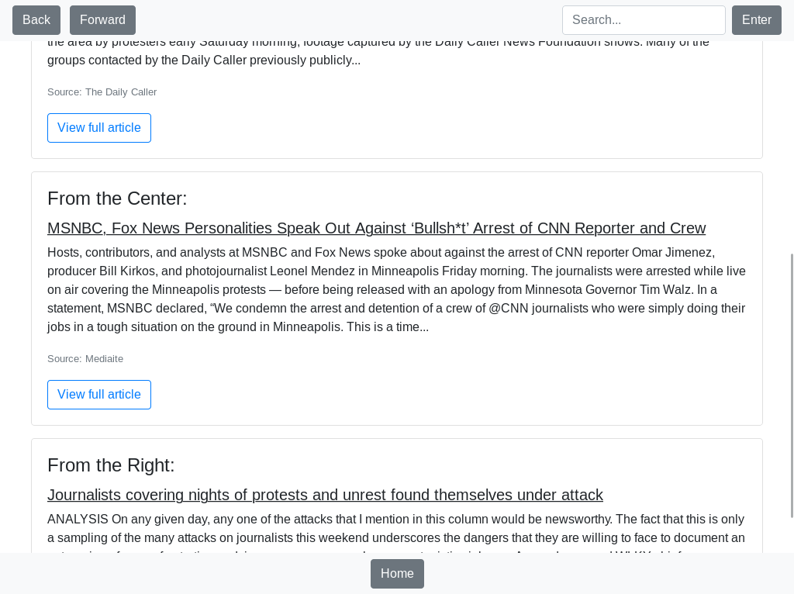

## The Project
Today, macOS and Windows dominate the operating system market, pushing for more functionality with every update, sacrificing simplicity in the process. As a result, I've acted as the 'IT' department in my family, constantly fixing and helping out with computer issues. What I've noticed in the process is that many times the issue is the complexity of the user interface itself. Because of this, Sam and I have devoted our ISP time to answering the question "how can we make computers easier to use?" After a significant amount of research in RED X, an entrepreneurial class offered at DS, we figured that we would have to completely redesign the user interface of a traditional personal computer. During our ISP, we've worked on an application that does every function that someone would want from a computer: from a word processor to an email client. The goal is that the user never leaves this application. The actual application is built on GTK, while having a web app (powered by Flask) display the sub-applications (ex. Email or News). Because this is such a wide-ranging problem, we've learned a little bit of everything from working with Google APIs to search algorithms.

Although we did get a significant amount of this project done during the ISP time, there is still more work to do. We are currently working on a minimum viable product (MVP) and hope to get a real product out soon.

*About the Name:*

There's no real reason that I chose this name. When I first started working on making computers easier to use, I called it Ruby. With the help of my RED X class, I changed that name because search engine results for 'Ruby' in relation to computing is going to be filled up by the programming language. Silva means "forest" in Latin and UI is short for User Interface. This project was originally going to be a full operating system--and therefore called SilvaOS--but because we want the most amount of people to be able to use it, we changed it to a downloadable application.

## Modules
At the beginning of the ISP, Sam and I wrote a list of every module of this project that we needed to complete. Modules could include applications that the user will interact with or even the update manager. Because our end goal is to build every aspect of the computer's software, this list was long. We narrowed down exactly what we wanted to accomplish for the given 5 weeks which is represented in the tree diagram below. 

  

## Applications
We decided to work on what we believed to be 6 most important applications, Home, Email, Search, News, Word Processor, and File Manager.

### Home:
In order to ensure simplicity in this project, we decided to make the home screen as minimal as possible. Inspired by iOS and Android, this is a grid layout, showing all of your applications on the same screen.

  

### Search:
The search application was the most ambitious. Our goal was to have a search bar on the top of the screen at all times, always allowing users to search the internet or their local computer. The reason that this was the extensive application in this is because we wanted to avoid using a traditional search engine as much as possible. After all, what's the point of having a closed ecosystem if they have access to the open internet? For pure information, we scrape information from Wikipedia, WolframAlpha, and Google. It gets more complicated when we integrate local file search. We also need to figure out what the user is actually looking for in their query. To figure out more information from the query, Sam developed a natural language processor, which takes in a sentence and returns the keywords which we run through other algorithms. 

  

### News

We understand the dangers of bias in media, so we wanted to find the best way to have transparency therefore we decided to take information from AllSides. So we essentially made a user interface version of AllSides. On the front page, we have top stories and if you click on a story, it shows you a short description with links to different stories on the Right, Center, and Left of the political spectrum. Using the same principle from Search, we didn't want to directly redirect the individual to the website. Instead, we took the body of the article and put it directly into the application allowing us to control the formatting. Because of this, all stories have the same formatting which adds familiarity to every action. Users still, however, have the option to go to the actual website of the story.

    
    
    
    

## Email:

The email app shows your inbox and a 'send email' button. Nothing else. If you click on an email, it shows the sender, date sent, and the body of the email with the option to delete the email or reply. The UI of the body input to send emails is the same as the Word Processor to have consistency.

    
    

## Word Processor
As the name of the application implies, this is a text editor. When you open the application, you type in the name of the new document (or select existing document) and start typing. There is limited formatting to allow the user to understand everything that's on the screen.

    
    

